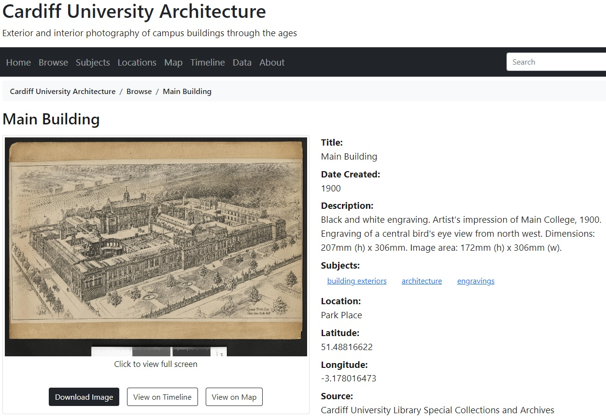

# CollectionBuilder

[CollectionBuilder](https://collectionbuilder.github.io/) is a static site generator designed specifically for hosting digital exhibitions. Users create a GitHub account, but no coding or command line knowledge is needed to set up or manage the project.

The focus is on metadata, not web design. All users need to do is gather a set of image files, and prepare their associated metadata in a standardised, csv format. CollectionBuilder uses this metadata to conjure an exhibition website according to a pre-programmed template, which can be hosted and served using GitHub Pages. 

Developed by University of Idaho Library as a tool to create free digital collections, staff soon recognised its equal potential as a teaching tool. It features a gentle learning curve that teaches the principles of good metadata management. Get the metadata right, and the site builds itself.

Being template-based, all sites built using Collection Builder will look the same in terms of layout - the only difference is the digital content supplied, and the functionality, which can scale according to need. At a basic level, images can be browsed and searched. But if additional metadata is provided, the images can also be categorised, mapped, or visualised by date. 

For example, including subject headings in metadata will generate a tag cloud, allowing browsing by category or theme. Including dates allows images to be sorted and visualised as a timeline. And finally, including latitude and longitude data will generate an interactive map, on which the images are 'pinned' to their geographic locations. The final product gives the impression that a lot of programming has gone into the site, when in fact, the content is driven solely by csv.

This is an [example of a CollectionBuilder site](https://aeh0.github.io/cu-buildings/) made with a sample of 30 dated, geolocated images. The images are taken from [Cardiff University's photographic archive](https://librarysearch.cardiff.ac.uk/discovery/collectionDiscovery?vid=44WHELF\_CAR:44WHELF\_CAR\_VU1\&collectionId=81204071960002420), and depict buildings at various points in the University's history, at different locations. 

<figure><figcaption></figcaption></figure>

The metadata includes subject headings, which have generated a [tag cloud](https://aeh0.github.io/cu-buildings/subjects.html); dates, which have generated a [timeline](https://aeh0.github.io/cu-buildings/timeline.html); and latitude and longitude data, which has generated an [interactive map](https://aeh0.github.io/cu-buildings/map.html). Clicking on images loads a [page which is populated with the relevant image metadata](https://aeh0.github.io/cu-buildings/item.html?id=coll029).&#x20;

<figure><figcaption></figcaption></figure>

Clicking on the image again loads it at full screen, where if the file is large enough, you can zoom into details in a similar manner to a [IIIF image](../what-is-iiif/examine.md).

<figure><figcaption></figcaption></figure>

### How to use CollectionBuilder

#### Create a new GitHub repository containing the template code&#x20;

1. Visit [CollectionBuilder's GitHub Pages repository](https://github.com/CollectionBuilder/collectionbuilder-gh)
2. On the repository home page, click the green **Use This Template** button (appears on right side above the code area).
3. This brings you to a **Create a new repository** page. Fill out using these options:
   * Create a lowercase repository name without spaces or special characters. This name will become part of your public site URL
   * Most users should choose **Public** repository. If you are hosting on GitHub Pages it _must_ be public unless you upgrade to a paid account
   * Leave the 'Include all branches' option unchecked
   * Click on the green button **Create repository from template**
   * You will be redirected to your new repository!

#### Add your images

Navigate to your repository's **Objects** folders. Delete the demo files. Gather the files you want to use for your project into a single folder on your PC. Consider the following:

* **File formats**. Only jpeg and png images, pdf documents, and mp3 audio are supported.
* **File size.** Unlike Wax, no thumbnails or access derivates will be created - the images loaded will be displayed at their original size. While CollectionBuilder lacks native support for IIIF, jpegs are displayed in a viewer that gives large files a similar zooming effect, though you may notice a slight delay to page load times. File size is therefore a question of balance across the project - you want large enough images to be viewed via zoom, but not too large that they slow the load time, or cause you to exceed GitHub's soft limits on total repository size, somewhere around 1 GB.
* **Filenames.** To avoid issues, use filenames that are unique, lowercase, and feature no spaces or special characters. Underscores (\_) are okay. You will use the exact filenames to populate the 'filename' field of your collection metadata.
* **Do you need to prototype?** CollectionBuilder looks great 'out of the box', but if you plan to spend some time configuring the appearance of your exhibition, consider adding just a few images to your repository in the first instance. If you change so much as a single character of code and want to see how your edit affects the appearance, you will need to 'commit the changes'. Think of this as saving your work. When you commit changes, the entire site will be indexed, which can take several minutes for larger sites. Committing changes will take just seconds if your site is lightweight - you can always add more, or larger, images once the site is set up to your satisfaction.

1. On the home page of your project repository on GitHub, click on the **Objects** folder that appears in the code area of the page
2. Click the **Add file** button and select **Upload files** (appears to right side of page)
3. Click **Choose your files** and navigate to the location of your object files on your PC, and select all the collection items. Or drag and drop all the files from your File Explorer / Finder into the GitHub page. Once the files are uploaded, they will appear listed on the page
4. Scroll down to the **Commit changes** box, write a short commit message in the form, e.g. 'add collection objects', then click the green **Commit changes** button to add them to your repository.

#### Create and add metadata

Extensive and detailed guidance is provided in the [documentation](https://collectionbuilder.github.io/cb-docs/docs/metadata/gh\_metadata/), including information on [formatting](https://collectionbuilder.github.io/cb-docs/docs/metadata/formatting/). It's recommended to work in Google Sheets in order to avoid encoding errors commonly caused by Microsoft Excel. When you've compiled your metadata according to the documentation, choose the option to Download as Comma-separated values. Give the file a name that uses all lowercase letters, no spaces, and no special characters - don't open it.&#x20;

1. From the home page of your project repository on GitHub, click on the **\_data** folder that appears in the code area of the page
2. Click the **Add file** button and select **Upload files** (appears to right side of page)
3. Click **choose your files**, navigate to the location of the .csv file on your PC, and select it. Or drag the file from your File Explorer / Finder into the GitHub page
4. Scroll down to the **Commit changes** box, write a short commit message in the form, then click the green **Commit changes** button to add the metadata to your repository

#### Configure your site

Next, we need to give Collection Builder information about the site, and where to find the metadata. This is controlled in a file called **config.yml**, which you can access on the main code page of your repository. Click on the filename, then on the pencil icon to the top right to start making edits.

* Essential edits include:

```
title: [The title as it will appear on every page's header and footer]
metadata: [The filename of your metadata .csv file without the extension, e.g. metadata]
```

* Optional edits include:

```
tagline: [An optional descriptive subtitle for the digital collection]
description: [One or two sentences of explanatory text about the collection
   - wrap it in "quotation marks". This description might appear in search 
   result lists, so keep it around 160 characters max]
author: [You! Use your name or GitHub username]
organization-name: [Use to reference your organisation in the site's
   citation, and serve as alternate text for your organisation's logo.
   Wrap in "quotation marks"
organization-link: [URL to your organisation's homepage]
organization-logo-nav: [URL image source for your organisation's logo]
```

* If you don't want to use any of the optional configurations, enter a hash (#) sign at the start of the line to tell the programme to skip over it
* When you've finished editing, scroll down to the **Commit changes** box, write a short commit message in the form, then click the green **Commit changes** button to confirm changes to the site's configuration

#### Enable GitHub Pages

* Finally, we need to be able to view the site!
* In your repository, navigate to the **Settings** page (appears on the right along the tabs above the code area): click **Pages** in the left side menu
* Under **Source**, leave the dropdown button as **Deploy from a branch**. Under **Branch** use the dropdown to change from **none** to **main**, then click the **Save** button.
* It will take a few minutes for the build to happen and your site to go live. Refresh the **Pages** page. If the build is successful, an alert will appear near the top providing the URL to your live site. The URL will follow the pattern: **https://username.github.io/repository-name**

For convenience, you might want to copy the URL to display on your repository home page:

1. Go to your repository’s home page
2. On right side of the code area, look for **About** section and click on the cog icon to edit
3. Check the box next to **Use your GitHub Pages website** then click **Save**. This will make it easy to locate the site in the future

#### Future customisation and changes

You can continue to customise the appearance of your site by modifying the HTML, CSS, and JavaScript files that are generated by CollectionBuilder. See the [documentation](https://collectionbuilder.github.io/cb-docs/docs/theme/) for full guidance.

To add new content to your collection, you can upload new images to your repository's **Objects** folder, and list them in your Google Sheets file, remembering to download and replace the old .csv file in **\_data.** If you make any changes, make sure to **commit** them to update your site.

Like [Google Sites](google-arts-and-culture.md), CollectionBuilder offers unbranded, ad-free web-hosting with generous storage. It works well without customisation, but if a user has coding knowledge or has an interest in learning, its appearance and functionality can be modified. However, it lacks native support for IIIF. If this is a requirement, take a look at [Wax](wax.md).

