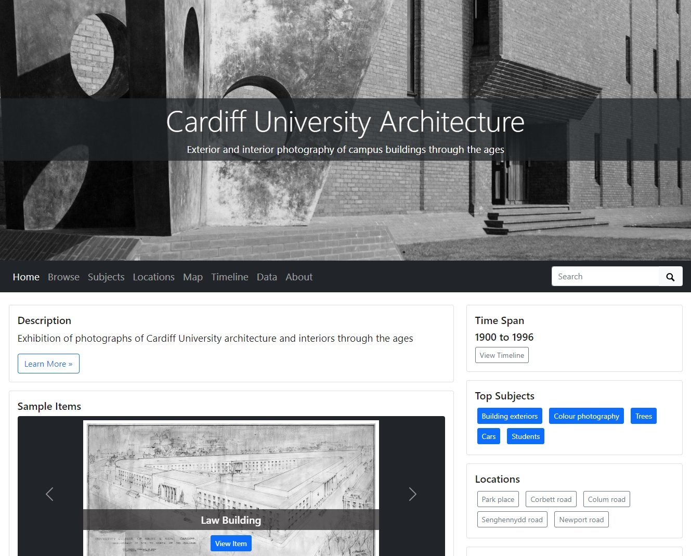
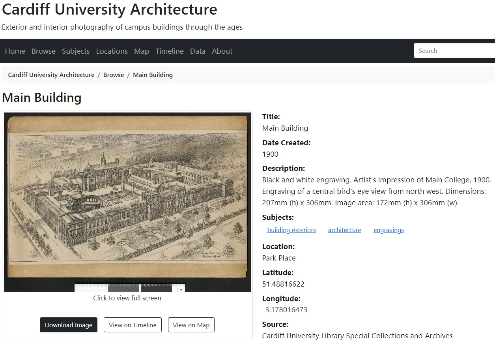

# CollectionBuilder

[CollectionBuilder](https://collectionbuilder.github.io/) is a static site generator designed specifically for hosting digital exhibitions. Users create a GitHub account, but no coding or command line knowledge is needed to set up or manage the project.

The focus is on metadata, not web design. All users need to do is gather a set of image files, and prepare their associated metadata in a standardised, csv format. CollectionBuilder uses this metadata to conjure an exhibition website according to a pre-programmed template, which can be hosted and served using GitHub Pages.&#x20;

Developed by University of Idaho Library as a tool to create free digital collections, staff soon recognised its equal potential as a teaching tool. It features a gentle learning curve that teaches the principles of good metadata management. Get the metadata right, and the site builds itself.

Being template-based, all sites built using Collection Builder will look the same in terms of layout - the only difference is the digital content supplied, and the functionality, which can scale according to need. At a basic level, images can be browsed and searched. But if additional metadata is provided, the images can also be categorised, mapped, or visualised by date.&#x20;

For example, including subject headings in metadata will generate a tag cloud, allowing browsing by category or theme. Including dates allows images to be sorted and visualised as a timeline. And finally, including latitude and longitude data will generate an interactive map, on which the images are 'pinned' to their geographic locations. The final product gives the impression that a lot of programming has gone into the site, when in fact, the content is driven solely by csv.

This is an [example of a CollectionBuilder site](https://aeh0.github.io/cu-buildings/) made with a sample of 30 dated, geolocated images. The images are taken from [Cardiff University's photographic archive](https://librarysearch.cardiff.ac.uk/discovery/collectionDiscovery?vid=44WHELF\_CAR:44WHELF\_CAR\_VU1\&collectionId=81204071960002420), and depict buildings at various points in the University's history, at different locations.&#x20;

<figure><figcaption></figcaption></figure>

The metadata includes subject headings, which have generated a [tag cloud](https://aeh0.github.io/cu-buildings/subjects.html); dates, which have generated a [timeline](https://aeh0.github.io/cu-buildings/timeline.html); and latitude and longitude data, which has generated an [interactive map](https://aeh0.github.io/cu-buildings/map.html). Clicking on images loads a [page which is populated with the relevant image metadata](https://aeh0.github.io/cu-buildings/item.html?id=coll029).&#x20;

<figure><figcaption></figcaption></figure>

Clicking on the image again loads it at full screen, where if the file is large enough, you can zoom into details in a similar manner to a [IIIF image](broken-reference).

<figure><figcaption>
Zoomed in detail
</figcaption></figure>

Try this step-by-step [CollectionBuilder workshop](workshop.md) for setting up a template digital archive.

Like [Google Sites](../google-arts-and-culture.md), CollectionBuilder offers unbranded, ad-free web-hosting with generous storage. It works well without customisation, but if a user has coding knowledge or has an interest in learning, its appearance and functionality can be modified. However, it lacks native support for IIIF. If this is a requirement, take a look at [Wax](../wax.md).
