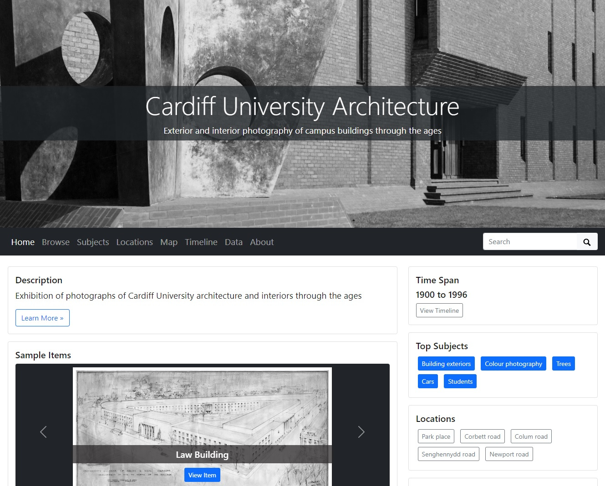

# Workshop

CollectionBuilder uses a template GitHub site to allow you to present a collection of digital images. All you need to do is add is your own images, makes some changes to the settings, and add a metadata file. The metadata is in csv format, and can be created and edited in Google Sheets. The metadata file tells the site everything it needs to know about your images - what they represent, and how to display them. Depending how much information you add to the metadata file, the page can:

* display all images alongside their descriptions
* allow images to be searched
* offer to filter images by subject or location
* present images in date order in a timeline
* pin image locations onto a map

GitHub Pages is used to make the site available online, with no hosting charges. Take a look at the [template site](https://collectionbuilder.github.io/collectionbuilder-gh/) to see how images are displayed.

In this workshop, you'll create your own sample site made with 30 dated, geolocated images. The images are taken from Cardiff University's photographic archive, and depict buildings at various points in the University's history, at different locations.&#x20;

The metadata will include subject headings, which will generate a browsable tag cloud, dates, which will generate a timeline, and latitude and longitude data, which will generate an interactive map. Clicking on an image will load a page which is populated with a description of the contents, and a zoomable image viewer.&#x20;

To make the site, you'll first make a copy of the template, then add a collection of sample images, and a sample metadata file. You'll make a couple of changes to a configuration file, then make your site live on GitHub Pages. You can repeat these steps, using your own images, to design and create your own digital archive or exhibition, on any subject.

## Prerequisites

* You will need to [set up a GitHub account](https://docs.github.com/en/get-started/start-your-journey/creating-an-account-on-github), if you don't have one already.&#x20;
* [Download and save the files](https://cf-my.sharepoint.com/:f:/g/personal/harveyae\_cardiff\_ac\_uk/ElHUwDRioyBPnjviUpeuYk8Bf0mYZLVsKeMwEivW78z\_zw?e=ZyWqbw) you'll use to create the sample site. There are 30 jpg images and 1 csv metadata file. You won't need to open or edit the csv file during this workshop, but if you do want to take a look, be sure to open the file using Google Sheets rather than Excel. Excel can introduce encoding that could later prevent the file from working properly. Below is a summary of the fields contained in the csv file, and how they're used. More information can be found in the CollectionBuilder [documentation](https://collectionbuilder.github.io/cb-docs/docs/metadata/gh\_metadata/).

<table><thead><tr><th width="169">Field name</th><th width="282">Contents</th><th>Dependency</th></tr></thead><tbody><tr><td>objectid</td><td>Unique identifier, e.g. img001</td><td>Essential</td></tr><tr><td>filename</td><td>Filename and suffix, e.g. image.jpg</td><td>Essential</td></tr><tr><td>title</td><td>Short description of image</td><td>Essential</td></tr><tr><td>creator</td><td>Name of creator</td><td>Optional</td></tr><tr><td>date</td><td>Date of creation</td><td>Required for timeline</td></tr><tr><td>description</td><td>Longer description of image</td><td>Optional</td></tr><tr><td>subject</td><td>Categorisation / grouping</td><td>Required for subject wordcloud</td></tr><tr><td>location</td><td>Name of location</td><td>Required for location wordcloud</td></tr><tr><td>latitude</td><td>Latitude of location</td><td>Required for map pins</td></tr><tr><td>longitude</td><td>Longitude of location</td><td>Required for map pins</td></tr><tr><td>source</td><td>Holding institution</td><td>Optional</td></tr><tr><td>identifier</td><td>URL link to catalogue</td><td>Optional</td></tr><tr><td>type</td><td>File type, e.g. image</td><td>Optional</td></tr><tr><td>format</td><td>File format, e.g. image/jpeg</td><td>Essential</td></tr><tr><td>language</td><td>Language of material</td><td>Optional</td></tr><tr><td>rights</td><td>Text-based summary of licence</td><td>Optional</td></tr><tr><td>rightsstatement</td><td>URL link to CC licence statement</td><td>Optional</td></tr></tbody></table>

## Make a copy of the site

1. You'll need to make a copy of the template site before you can edit it, and save it in your own work area, what GitHub calls a 'repository'. Log into your GitHub account, then visit the [CollectionBuilder repository](https://github.com/CollectionBuilder/collectionbuilder-gh).
2. On their home page, click the green **Use This Template** button (appears on right side above the code area).
3. This brings you to a **Create a new repository** page. This will be your new work area. Fill out using these options:
   * Leave the 'Include all branches' option unchecked.
   * Create a lowercase repository name without spaces or special characters. This name will become part of your public URL, so choose something that reflects the content of your site.
   * Most users should choose **Public** repository. If you are hosting on GitHub Pages it _must_ be public unless you upgrade to a paid account.
   * Click on the green button **Create repository.**
   * You will be redirected to your new repository! Here, you can add new images and replace the metadata, without impacting the original template.

## Make your site live

1. You haven't finished your site yet, but because making a site live can take a little time, start the process now. You make your site live by enabling GitHub Pages.
2. Navigate to the **Settings** page (appears on the right along the tabs above the code area), and click **Pages** in the left side menu.
3. Under **Source**, leave the dropdown button as **Deploy from a branch**. Under **Branch** use the dropdown to change from **none** to **main**, then click the **Save** button.
4. Go back to your homepage by clicking on your repository name in the top left corner. On the right side of the code area, look for the **About** section and click on the cog icon to edit.
5. Tick the box next to **Use your GitHub Pages website** then click **Save**. This will make it easy to locate your site in the future.
6. Open the link that appears in a new tab - at the moment, it will show the CollectionBuilder template, but as you make changes, they'll update here.

## Add your images

1. On the home page of your project repository on GitHub, click on the **Objects** folder that appears in the code area of the page
2. Click the **Add file** button and select **Upload files** (appears to right side of page)
3. Click **Choose your files** and navigate to the location of your object files on your PC, select all the jpgs using the shift key, and open. Or, drag and drop all the files from your File Explorer / Finder onto the GitHub page. Once the files are uploaded, they will appear listed on the page alongside the original demo content
4. Finally, save and document your work, which is known in GitHub as 'commit changes'. Scroll down to the **Commit changes** box, write a short commit message (to document the change), e.g. 'add images.' Then click the green **Commit changes** button. The images are now saved in your repository. Your live site won't have changed yet, because there's no metadata associated with the images - you can add it now.

## Add your metadata

1. From the home page of your project repository on GitHub, click on the **\_data** folder that appears in the code area of the page.
2. Click the **Add file** button and select **Upload files** (appears to right side of page).
3. Click **choose your files**, navigate to the location of the .csv file on your PC, and select it. Or drag the file from your File Explorer / Finder into the GitHub page.
4. Scroll down to the **Commit changes** box, write a short commit message in the form (e.g. 'add metadata'), then click the green **Commit changes** button to add the metadata to your repository.
5. The live site still won't have updated - it has images and metadata, but it doesn't know where to find them. In the final step, we'll give CollectionBuilder the information it needs to build the site.

## Configure your site

CollectionBuilder can't make your site until it knows where the images and metadata are held. These instructions are stored in a file called **config.yml**, which you can access on the main home page of your repository. Click on the filename, then on the pencil icon to the top right to start making edits.

### Essential edits

* **Title.** The site title as it will appear on every page's header and footer, and in search results.
* **Metadata.** The filename of your metadata .csv file with the .csv extension removed. This single line of code is critical - it tells the computer where to find the metadata file. Once it can locate this file, it can use it to find your image files and their descriptions - and use them to build your site.

Set these lines of code:

```
title: Cardiff University Architecture
metadata: cu-buildings
```

### Optional edits

* **Tagline.** An optional descriptive subtitle for the digital collection
* **Description.** One or two sentences of explanatory text about the collection. Wrap it in "quotation marks". This description might appear in search result lists, so keep it to 160 characters max.
* **Author.** You! Use your name or GitHub username.
* **Organization-name.** Use to reference your organisation in the site's citation, and serve as alternate text for your organisation's logo. Wrap in "quotation marks".
* **Organization-link.** URL to your organisation's homepage.
* **Organization-logo-nav.** URL image source for your organisation's logo.

If you don't want to use any of the optional configurations, enter a hash (#) sign at the start of the line to tell the programme to skip over it

Set these lines of code:

```
tagline: Exterior and interior photography of campus buildings through the ages
description: "Exhibition of photographs of Cardiff University architecture and interiors through the ages"
author: [your name or GitHub username]
# organization-name: 
# organization-link: 
# organization-logo-banner: 
# organization-logo-nav: 
```

When you've finished editing, go to the **Commit changes** box, write a short commit message in the form, then click the green **Commit changes** button to confirm changes to the site's configuration.

### Update header image

* We need to update the image shown in the website's header. From the home page of your project repository, go to the **\_data** folder, and click on **theme.yml.** Click the pencil icon to edit the file.
* Change the featured image from demo\_001 to one of your own files. img022 works particularly well.

```
featured-image: demo_001
```

### Update map location

* If you check the map page on your live site, you'll see it's still configured for US locations. You can change that further down the theme.yml file, under # MAP PAGE.&#x20;
* Replace your code with the following to centre the map in Cardiff, at a deeper zoom level.

```
latitude: 51.4881328096303 #to determine center of map
longitude: -3.17653117103201 #to determine center of map
zoom-level: 16 # zoom level for map 
```

* When you've finished editing, go to the Commit changes box, write a short commit message in the form, then click the green Commit changes button to confirm changes to the site's configuration.
* Your final result should look like this - congratulations!

<figure><figcaption></figcaption></figure>

Clicking on an image will load a page which is populated with the relevant image metadata:

<figure><figcaption></figcaption></figure>

Clicking on an image again loads it at full screen, where if the file is large enough, you can zoom into details in a similar manner to a [IIIF image](broken-reference).

<figure><figcaption></figcaption></figure>

You can continue to customise the appearance of your site by modifying the HTML and CSS files that are generated by CollectionBuilder. See the [documentation](https://collectionbuilder.github.io/cb-docs/docs/theme/) for full guidance. You can find free tutorials on responsive web development on [FreeCodeCamp](https://www.freecodecamp.org/learn/2022/responsive-web-design/).

## Making your own CollectionBuilder site

Now that you know how to make a sample site using CollectionBuilder, you could make your own digital archives and exhibitions with your own images. Make sure they're out of copyright, or you own the rights to share them online. Below are some other elements to consider while planning your own site.

### **Customisation**&#x20;

CollectionBuilder looks great without any customisation, but if you plan to spend some time configuring the appearance of your exhibition by changing its html and css, consider making a lightweight prototype, by adding just a few images to your object folder in the first instance.&#x20;

If you change just a single character of code and want to see how your edit affects the appearance, you will need to 'commit the changes' to save your work. When you commit changes, the entire site is indexed. For larger sites with lots of images, you could be waiting several minutes to see the result of each change. If your site is lightweight, it'll take a couple of seconds. Once you're happy with the design and layout, it's easy to add more images to your object folder, and complete the site.

### **File formats**

Only jpeg and png images, pdf documents, and mp3 audio are supported.

### **File size**

Unlike [Wax](../wax.md), no thumbnails or access derivates will be created - all images loaded will be displayed at their original size. While CollectionBuilder lacks native support for IIIF, jpegs are displayed in a viewer that gives large files a similar zooming effect, though you may notice a slight delay to page load times. File size is therefore a question of balance across the project - you want large enough images that they will zoom without pixelating, but not so large that they slow the load time.

### **File quantity**

GitHub has a soft limit on total repository size, around 1 GB, and CollectionBuilder recommends keeping file storage to a 500MB limit for optimal performance. If you want to exceed that, try hosting your images on the Internet Archive.&#x20;

In the filename column of the metadata csv, instead of using the name of the locally hosted file (e.g. LMG000054.jpg), upload the file to the Internet Archive, then paste the direct link to the image file in the filename column.&#x20;

In the case of a jpg, you can find this by clicking on the image, e.g. [https://archive.org/details/LMG00054](https://archive.org/details/LMG00054), when clicked, turns into [https://archive.org/download/LMG00054/LMG00054.jpg](https://archive.org/download/LMG00054/LMG00054.jpg). The site will then pull your images from the Internet Archive, rather than from your objects folder.

### **Filenames**

To avoid issues, use filenames that are unique, lowercase, and feature no spaces or special characters. Underscores (\_) are okay. You will use the exact filenames to populate the 'filename' field of your collection metadata.

### **Metadata**

Extensive and detailed guidance on metadata creation is provided in the [documentation](https://collectionbuilder.github.io/cb-docs/docs/metadata/gh\_metadata/), including information on [formatting](https://collectionbuilder.github.io/cb-docs/docs/metadata/formatting/). It's recommended to work in [Google Sheets](https://www.google.co.uk/sheets/about/) in order to avoid encoding errors commonly caused by Microsoft Excel.&#x20;

When you've compiled your metadata in Sheets, according to the documentation, choose the option to Download as Comma-separated values. Give the file a name that uses all lowercase letters, no spaces, and no special characters. Once it's downloaded - don't open it.&#x20;
