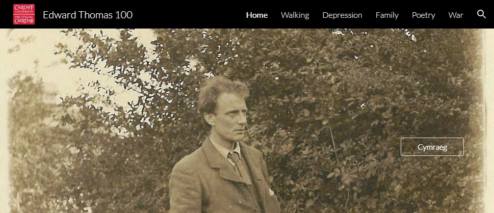
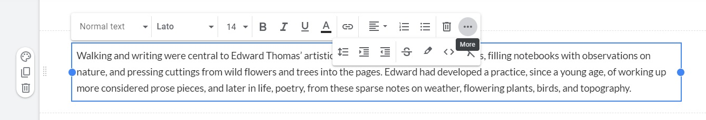

# Google Sites

[Google Sites](https://sites.google.com) is an ideal tool for making simple, free websites, with no adverts or branding, and requiring no coding knowledge.

<figure><figcaption>
Sample exhibition website made with Google Sites.
</figcaption></figure>

### Features

* No advertisements or branding

The main advantage over other free website builders, such as Wordpress and Wix, is that Google Sites will not display adverts communicating political or commercial bias on your site, making it more suitable for neutral, scholarly publications. The example below is taken from a Wordpress blog post - a Wordpress site owner is unable to control the nature, quantity or quality of the advertising shown without upgrading to a paid subscription.

<figure><figcaption>
Example of politically biased advertising appearing on a scholarly Wordpress blog.
</figcaption></figure>

If you purchase a domain name for a small annual charge, Google Sites allows you to apply it to your site, e.g. http://\[sitename].com, but if you'd prefer to have no ongoing financial commitment, Google's free URLs are professional and reasonably short: https://sites.google.com/view/\[sitename]. Apart from 'google' featuring in the URL, no branding will appear on your site, and there's a free option to customise the header with an institutional logo, to comply with any local branding requirements.

* Build intuitively, no coding required

Websites can be built from templates, or completely from scratch, without any need for coding knowledge. Click into the header and start typing to name your site. Then add components - text boxes, images, buttons, dividers, videos, image carousels, or pre-styled content bocks - by dragging and dropping onto the page. Components can be resized and rearranged by simply clicking and dragging. New pages can be added and nested - a menu navigation bar will be generated automatically. It doesn't take long to make a clean, professional looking site.

Appearance can be customised consistently, site-wide, by applying a theme, or at the level of the individual component. Clicking on a component will prompt which actions can be taken. A text box offers customisations for formatting - font style, size, colour, links, bullet points, indents, etc.

<figure><figcaption>
Clicking on a component, such as a text box, will reveal a range of customisable options.
</figcaption></figure>

An image will offer options for cropping, adding links, captions and alt text. In short - if you're not sure how something works, try clicking on it. The interface is very intuitive, and all decisions are reversible. Undo and redo buttons at the top of the page can roll back or repeat actions.&#x20;

* Google integration

Unlike Storiiies and Exhibit, you will need a Google account, and log in to use this tool. On the plus side, there are no additional passwords to worry about, and setup is seamless if you already have an account. Google Sites is fully integrated with all other Google products, should you wish to feature calendars, maps, documents, slides, spreadsheets, forms, or charts. You can use Google Analytics to track page views and site traffic (though options for search engine optimisation are limited - it isn't a tool designed for business use). All content and changes are backed up in Google Drive. Sites can be published and unpublished to the web in one click.

* Flexible view/edit access

Your site can be fully public on the internet, or only visible to users you have shared a link with. This is a useful feature if you intend to set students an assessment task, and would like to keep their work private (but shared with assessors). It's also possible to give editor access to multiple collaborators, allowing students to work together on a single website as a group project.

* Support for bilingual websites

This isn't a built in feature, but can be achieved by building a website in one language, then duplicating it. In the duplicated site, change the text as needed while retaining layouts and formatting, then add buttons to both sites which direct to their equivalent in the second language. [This example](https://sites.google.com/view/edwardthomas100) links to Welsh language pages using a button in the header. This approach ensures parity of viewing experience regardless of the preferred language in which people choose to browse your site.

* Support for embedding IIIF objects

Use the embed code in IIIF viewers to feature zoomable, browseable IIIF objects in your website. Edit the code to set the height and width parameters to 100% to ensure that your embedded images are responsive, and look good on any size of screen.

### Disadvantages

The cons are largely the same as the pros - because Google Sites is simple and requires no coding knowledge, functionality is limited. You won't be able to add custom CSS or add any kind of interactivity with Javascript.

More functionality is available through products like [Wordpress](https://wordpress.com/free/), [Wix](https://support.wix.com/en/article/free-vs-premium-site) and [Weebly](https://www.weebly.com/uk/pricing) if this is important for your project, but there are disadvantages. All feature ads, branding, and a limit on storage and bandwidth

For an unbranded, ad-free web-hosting with generous storage, AND which is fully customisable (with coding knowledge), take a look at [Wax](wax.md).

