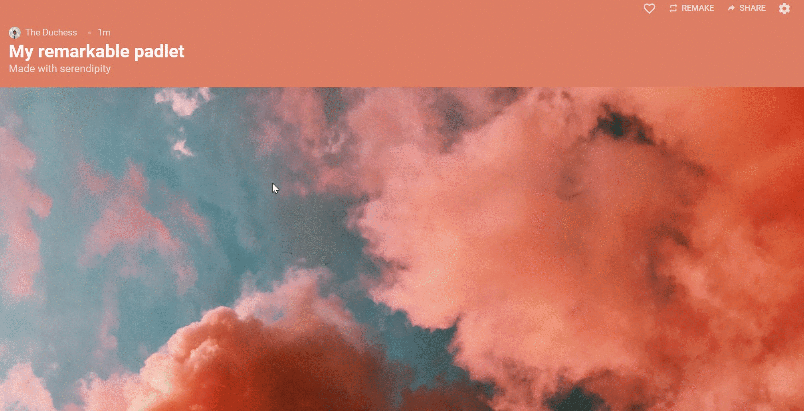

# Padlet

[Padlet](https://en-gb.padlet.com/) is a free organisational tool that is extremely easy and intuitive to use. It has a range of applications for supporting exhibitions, from the early planning stages of collecting text, images, and links from multiple collaborators, right up to hosting the final product.

Many educational organisations will have an institutional subscription that supports unlimited projects per user, but anyone can register for the free version (the 'neon' package), which allows the creation of up to three projects. There is a maximum size limit of 20MB per file upload, but you can upload as many files as you like, and there is no limit on the number of collaborators who can work on a project simultaneously.

Adding notes is as simple as typing, and clicking '**Publish**' - anyone can use Padlet.&#x20;

<figure><figcaption></figcaption></figure>

Many more formats are supported, including images, videos

There are a range of layouts that work well for different applications. Canvas is useful at the very beginning of the planning process - it supports unstructured notes which can be dragged and rearranged in any configuration. Multiple users can contribute, without needing Padlet accounts.

Shelf for planning. This lets you arrange notes, images, and links in columns under category headings. It's useful for organising research into themes, which will later form a structure for a digital archive or exhibition.

Grid and Wall for easy reading of unstructured information. Stream for a narrative. Map for geotagging locations. Timeline for a chronological approach.

<figure><figcaption></figcaption></figure>
