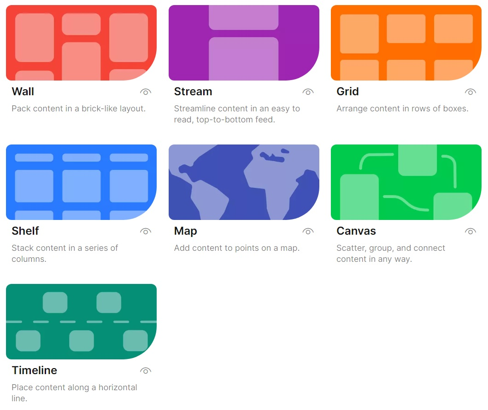

# Padlet

[Padlet](https://en-gb.padlet.com/) is a free organisational tool that is extremely easy and intuitive to use. It has a range of applications for supporting exhibitions, from the early planning stages of collecting text, images, and links from multiple collaborators, right up to hosting the final product.

### Features

* Free version offers full functionality for up to three projects

Educational organisations may have an institutional subscription that supports unlimited projects per user, but anyone can register for the free version (the 'neon' package), which allows the creation of up to three projects. There is a maximum size limit of 20MB per file upload, but you can upload as many files as you like, and there is no limit on the number of collaborators who can work on a project simultaneously.&#x20;

* Easy and intuitive, supporting a wide range of content types

Adding an entry is as simple as typing text, and clicking '**Publish**'. As well as text, users can add images, Word, Excel, and PowerPoint documents, links, audio, videos, [screen recordings](https://www.youtube.com/watch?v=7NEr--UHGso), and even [drawings](https://www.youtube.com/watch?v=aDIfzHc1K2c). Padlet is available in [over 40 languages](https://padlet.help/l/en/about-padlet/do-you-have-it-in-my-language), and multiple users can contribute simultaneously, without needing Padlet accounts.

* Range of privacy settings

Projects are 'secret' by default, meaning that anyone with a link can access them, but the project will be hidden from Google. There is also the option to make a project public (visible to Google), password protected, or entirely private (accessible only to the creator and any user who has been [invited through their Padlet account](https://www.youtube.com/watch?v=f2QhaaJvTrM)). If you want to use Padlet for assessment, but are concerned that students may need to use modern, copyrighted images, you could use these settings to keep their projects restricted to assessors only. Whether projects use copyright-free images publicly or copyrighted images privately, such an assessment can be a good opportunity to discuss restrictions surrounding intellectual property with your students.

* Versatile layouts for presenting information

There are a range of layouts that you can switch between as your project evolves - some are more suitable than others depending on what you're trying to achieve. **Canvas** is useful at the very beginning of the planning process - it supports unstructured notes from brainstorming activities, which can be [dragged and rearranged](https://www.youtube.com/watch?v=2vJX0yqDs6Y) in any configuration. It can be used just as effectively to present a final exhibition, e.g. [The New Woman: The Bicycle and “Rational Dress”](https://padlet.com/saralambert/the-new-woman-the-bicycle-and-rational-dress-egzgzb4fdus4fsd0).

<figure><figcaption>
The seven available Padlet layouts.
</figcaption></figure>

**Grid** and **Wall** are equally suitable for unstructured information, and can make it easier to read, by organising posts either into a defined grid layout, or simply filling the space available (e.g. [History and Scholarship of Protest](https://padlet.com/hedreenr1/history-and-scholarship-of-protest-a-buley-library-online-ex-w9eisgyd81jh5usq)). These work particularly well with images (if you have ever used [Pinterest](https://www.pinterest.co.uk/), you will have seen a 'wall' style layout used to good visual effect).&#x20;

When you need to organise content, use **Shelf**. This lets you arrange notes, images, and links in columns under category headings. This could be used for organising research into themes, which will later form a structure for a digital archive or exhibition.

When you're ready to build your archive or exhibition, there are a number of good options depending on your content. If you want to present an interactive map of locations, **Map** will allow you to geotag your entries (e.g. [Seven Wonders of the Ancient World](https://padlet.com/gallery/map-of-the-7-wonders-of-the-ancient-world-pvbf1n4qkycw)).&#x20;



If you want to present information chronologically, use **Timeline** (e.g. [Apollo Missions](https://padlet.com/gallery/timeline-of-apollo-missions-jujsg84hh9fq)).



**Stream** is a good option for hosting a full exhibition on Padlet. It supports a scrolling, illustrated narrative, and looks very professional. The Higgins Bedford Art Gallery and Museum have used the Stream format in Padlet to create their exhibition ['Paved with Gold': Bedford's Windrush Generation](https://padlet.com/thehiggins/paved-with-gold-bedford-s-windrush-generation-zo2jrvavc88d7r7t).

If you like the look of Padlet, but need more than three projects, take a look at [Wakelet](https://wakelet.com/), which is a similar resource. It offers unlimited projects with less functionality, supporting just Grid, Wall ('Mood Board'), and Shelf ('Columns') layouts.

Like [Storiiies ](../digital-storytelling/storiiies.md)and [Exhibit](../digital-storytelling/exhibit.md), projects on Padlet can be [embedded ](https://www.youtube.com/watch?v=bTKWJnZ\_-78)into other websites (see the example below). You could use the Map or Timeline formats to create interactive elements that can be featured as part of a wider exhibition hosted elsewhere.


Example of an embedded Padlet exhibition.


Padlet offers detailed instructions on [how to create a project](https://padlet.help/l/en/get-started/how-do-i-create-a-padlet), and [how to customise settings](https://padlet.help/l/en/article/pleoh3181b-how-do-i-customize-my-padlet), as well as [tutorial videos](https://www.youtube.com/@padlet/videos) on various aspects of its functionality.
