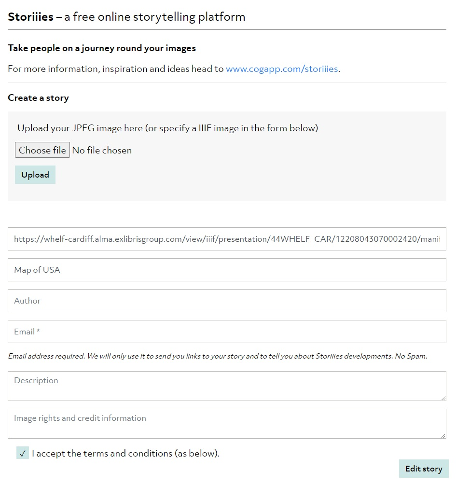
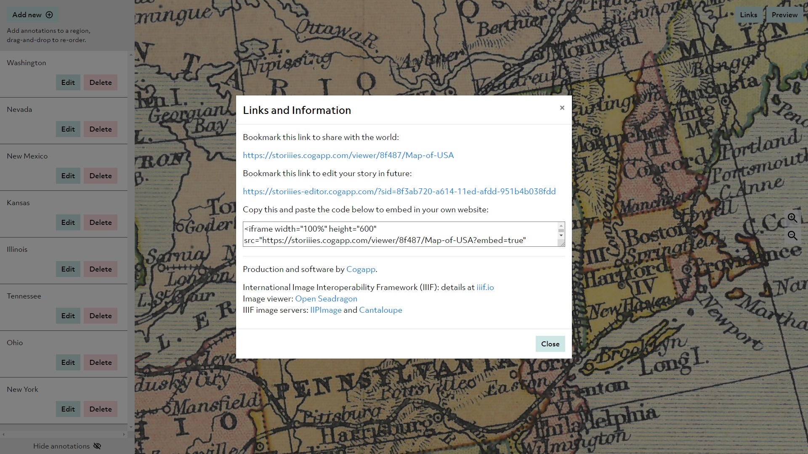

# Storiiies

Storiiies is the best place to get started with image annotation. You can use it with IIIF images, but they're not essential - you can use any large jpeg. It offers a free and simple interface that allows you to upload an image, zoom into details, and tag any area of interest with text. The final presentation will move through the annotated areas in order. Currently, you can only add one image to a single presentation (use [Exhibit](exhibit.md) if you need to add more). Storiiies supports close readings of a single image, for exhibition purposes, teaching, or as a learning exercise.

Here are some examples of guided viewing presentations made using Storiiies - featuring Hans Holbein's painting, [The Ambassadors](https://storiiies.cogapp.com/viewer?manifest=https://storiiies.cogapp.com/holbein/manifest.json), and George Cruikshank's etching, [State Miners](https://sharc.kcl.ac.uk/exhibition/section-two-acting-royal/a-mad-king-king-lear/state-miners-1).

Start by opening the [Storiiies editor](https://storiiies-editor.cogapp.com/). This is web-based, and doesn't require users to sign in or download anything.

If you want to annotate a IIIF image, paste the manifest link in to get started. Use the [guide to finding IIIF manifests](../what-is-iiif/finding-iiif-images.md), or copy this link to an [1881 map of America](https://whelf-cardiff.alma.exlibrisgroup.com/view/iiif/presentation/44WHELF\_CAR/12208043070002420/manifest), if you need a quick example. If you're using a standard jpeg, upload the file. Large, high resolution jpegs work best - if the file isn't large enough, you won't be able to zoom in far enough to make useful annotations.&#x20;

Give your presentation a title. Add an author, description, or credits if needed (these fields are optional). You will need to supply an email address - this will be used to send you a link to your finished presentation and join the Storiiies mailing list (from which you can unsubscribe).

<figure><figcaption></figcaption></figure>

Accept the terms and conditions to start editing your image. These clarify that Storiiies:

* is a free platform, and does not commit to long term storage of presentations
* reserves the right to remove inappropriate or rights-infringing images
* will not claim any copyright in the images uploaded or presentations created

When the editing interface opens, try zooming in, and clicking **Add new**, to add an annotation. Repeat as many times as needed. When you click **Submit**, the annotation will be attached to the section that has been zoomed into. You can go back and edit the annotations, delete them, or drag and drop to reorder them.&#x20;

When finished, use **Preview** to see the results. Here's an example I made with the [USA map](https://storiiies.cogapp.com/viewer/8f487/Map-of-USA).&#x20;

When you're happy with the presentation, go back to the editing interface, and click **Links**. This gives you a viewing link, embed code, and - most importantly - a link that allows you to make further edits in the future. These links will also be emailed to you, using the address provided. Storiies doesn't maintain user accounts, so these links are the only way to get back to your presentation - keep them safe!

<figure><figcaption></figcaption></figure>

