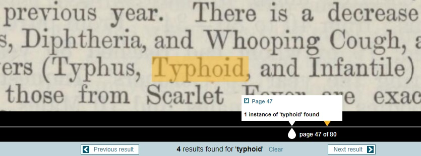
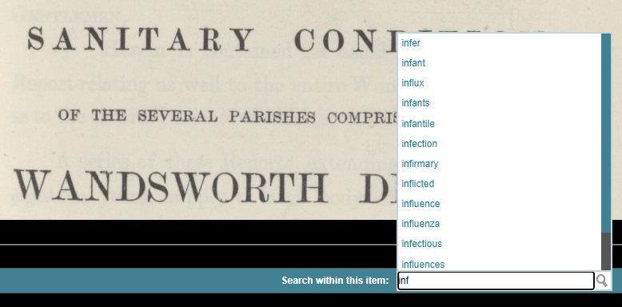
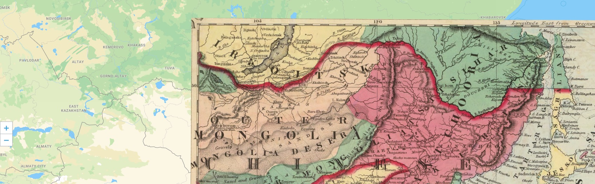
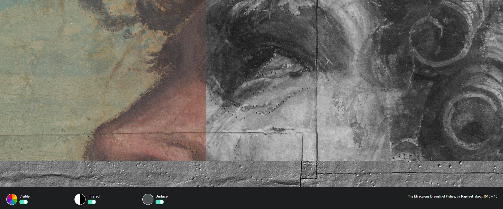
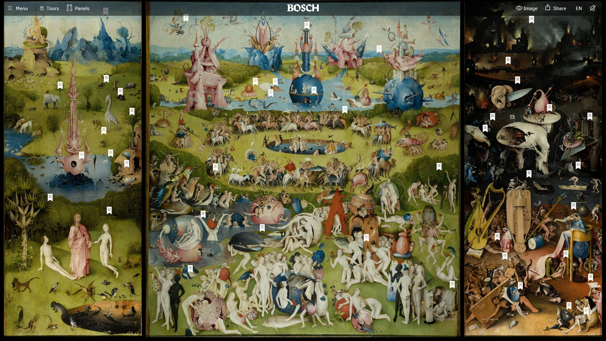

# Connect text and image

Earlier in the workshop, we looked at how IIIF images are tiled into digital segments, making them fast to load. It also makes it possible to share a precise detail of an image, because each tile of a IIIF image exists as a separate digital entity.

Go back to the [Night Watch](https://hyper-resolution.org/view.html?pointer=0.329,0.001\&i=Rijksmuseum/SK-C-5/SK-C-5\_VIS\_20-um\_2019-12-21), and zoom in, or pan around - note that the coordinates in the address bar update as you move, and the location is captured in the URL.

Being able to define and save a specific section of an image using a URL means that it's possible to connect additional text or images, enhancing the original.

### Transcription

Connecting a plain text transcription to images from a book makes the words they contains searchable. This makes it possible to search for a single word across a gigantic corpus of texts. Take a look at this [Medical Officer's report](https://wellcomelibrary.org/moh/report/b18250464/0#?c=0\&m=0\&s=0\&cv=0\&z=-1.788%2C-0.1202%2C4.589%2C1.7914) from the Wellcome Collection, which has a connected transcription, allowing the text to be accessed via a search function. Without it, each word in this report would only be an image of a word.&#x20;

<figure><figcaption>
The precise location of the search term is indicated.
</figcaption></figure>

Try searching for 'influenza' in the keyword search box - notice that as you type, other words contained in the work that start with 'inf...' are suggested. This is particularly useful if the spelling of the word you want to search for has changed over time, as is often the case in historical sources.

<figure><figcaption>
All words in a text are indexed, and alternative search terms are suggested as you type
</figcaption></figure>

When you search for 'influenza', you'll find 9 results. When you click on one of the yellow markers, you'll be taken to a page on which that word can be found, with the precise location of the work digitally highlighted.

### Overlay

Some images may be enhanced by overlaying another image on top, which can be viewed or hidden as needed. A geographer may wish to overlay a 19th century map on top of a modern version, to visualise spatial change over time, while an art historian might want to overlay a preliminary sketch or underpainting with the finished result.

<figure><figcaption>
Example from <a href="https://www.georeferencer.com/compare">Georeferencer</a>
</figcaption></figure>

Take a look at these [Raphael cartoons](https://vanda.github.io/curtain-viewer/) from the Victoria and Albert Museum, which have been digitised using three different techniques, with the resulting images overlaid. Try clicking the 'infrared' toggle, then scroll over the painting. You can now see two layers - the painting's surface, and the original charcoal underdrawing, made visible using infrared photography. Clicking the 'surface' toggle adds a third layer - the 3D surface of the canvas. This allows us to see tiny pinpricks in the painting, created when the designs were transferred to fabric in order to be made into tapestries.

<figure><figcaption>
All three layers are visible - painting, underpainting, and canvas surface
</figcaption></figure>

### Commentary

IIIF allows curatorial commentary to be connected to areas of images, allowing us to tell stories, or analyse interesting details.

The Rijksmuseum used this capability to create [guided, multimedia tours of the Night Watch](https://beleefdenachtwacht.nl/en).

One interesting use of curatorial commentary beyond the cultural heritage sector, is this ambitious, richly annotated version of [The Garden of Earthly Delights](https://archief.ntr.nl/tuinderlusten/en.html) by Jheronimus Bosch. Created by NTR, a Dutch public service broadcaster, this annotation project describes itself as an 'interactive documentary'. Click on the flags to zoom in on the painting, and hear or read an explanation of that section.

<figure><figcaption>
An annotated version of <a href="https://archief.ntr.nl/tuinderlusten/en.html">The Garden of Earthly Delights</a> by Jheronimus Bosch
</figcaption></figure>

In the next section, we'll look at free tools for making your own narratives and tours of books, manuscripts, and artworks.
