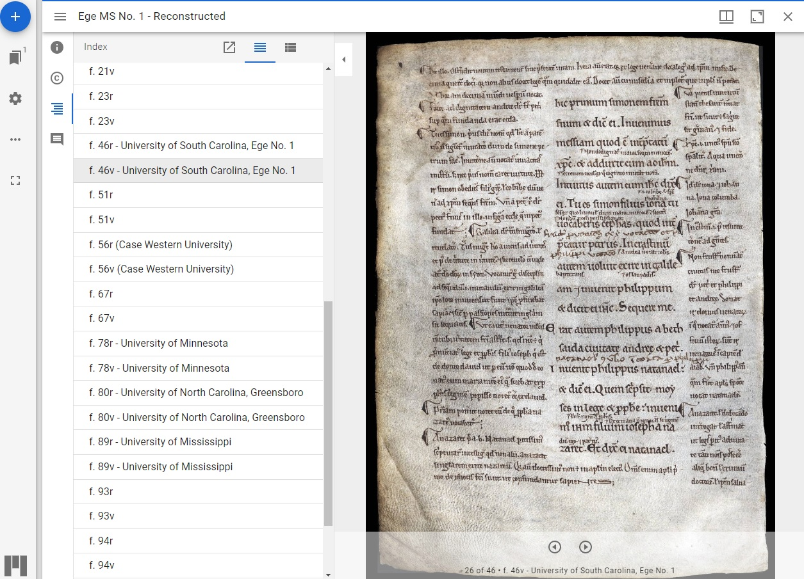

# Context is key

In the last section, we found a IIIF object, and opened it in Universal Viewer. Universal Viewer is one of several IIIF viewers available. Each viewer has slightly different benefits and functionality for the user, and it's worth trying a few to see which you prefer. For more in-depth information about the different available viewers, and how to use them, see the [IIIF website](https://iiif.io/guides/using\_iiif\_resources/).

You might be wondering why you need to use a IIIF viewer, when it's simple enough to copy or download an image and email it.

The difference lies in **context**. IIIF viewers fetch all images in an object from the links provided in the manifest, and uses the packaged code to organise them in the correct order. The viewer also unpacks any metadata that describes what those images represent, and presents it alongside the image. In that way, a link is always maintained between a single image, and its wider context. An image will never be orphaned from the object it belongs to, or the repository it belongs to. It will always retain a connection to information that describes the image, where it comes from, and what you can and can’t do with it in terms of licensing.

IIIF is designed for the responsible sharing of images, and makes it easy to see at a glance what terms and conditions may apply to re-use. IIIF images are never ‘lost’ online. Their metadata anchors them to the home repository, and to any licences that may apply. This encourages cultural organisations and their partners to trust that digitisation will widen access to their collections in a managed and responsible way. Downloading, sharing, and embedding links are built into every IIIF viewer, using stable URLs appropriate for robust scholarly citations.

The metadata that is bundled into a manifest can refer either to an object as a whole, or to individual images within it. This is particularly useful when examining digitally reunited manuscripts, such as this [glossed Bible](https://projectmirador.org/embed/?iiif-content=https://dms-data.stanford.edu/data/manifests/Stanford/ege1/manifest.json).&#x20;

Clicking on the hamburger icon (three horizontal lines) in the top left reveals an Information panel containing contextual background about the circumstances of the Bible's destruction and reconstruction. Below the **Information** button is a **Rights**, or attribution button, describing which organisations have contributed their images to the object, and below that is an **Index**, itemising each page and which library it belongs to.

<figure><figcaption>
The Index in the metadata panel indicates which page belongs to which institution
</figcaption></figure>

Some UK organisations are working on [embedding IIIF image viewers inside their archives catalogues](https://blog.archiveshub.jisc.ac.uk/2022/11/30/exploring-iiif-for-the-images-and-machine-learning-project/). This would mean that not only would you see the item’s description when you look at an image, you would also be able to understand the relationship of that item to its wider archival context.&#x20;

For example, when looking at a letter from person A to person B, you might want to know: how many other letters were sent from A? Over what period? Are there replies from B? These are questions that an archive catalogue can answer, but which are difficult to ascertain when searching thousands of images gathered in a repository. This development work has the potential to transform the archives research experience, and work to close the gap between archive catalogues on the one hand, and digital repositories on the other.

As IIIF content can be contextualised and shared responsibly, respecting image rights and attributions, it can be endlessly repurposed for scholarly projects. In the next sections we'll look at sharing, comparing and collaborating with IIIF.
