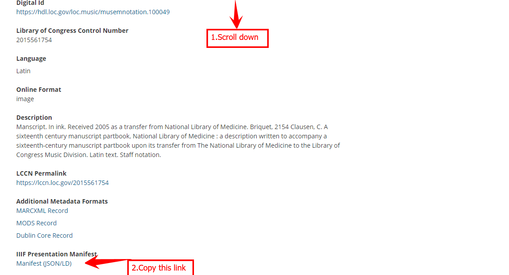

# Find IIIF images

Cultural heritage institutions that deliver freely licensed access to their digital collections using IIIF are listed on the [IIIF website](https://iiif.io/guides/finding\_resources/). The list includes major museums and galleries, state and national libraries, and research-led universities from around the world. The number of cultural heritage items made available via IIIF is estimated at 1 billion.

### Manifests explained

Go to the [list of institutions that support IIIF](https://iiif.io/guides/finding\_resources/) on the IIIF website. Each institution's name will lead you to a dedicated page that provides a link to their digital collections platform, and an annotated screenshot explaining where to find the **manifest**.

Manifests are the key to unlocking IIIF items for re-use. Here are some examples:

* https://access.ecodices.nl/iiif/presentation/MMW\_10\_A\_12/manifest
* https://www.loc.gov/item/mss859430239/manifest.json
* https://dam.museabrugge.be/iiif/3/418/manifest.json

Manifests look like links, but they're more like parcels. Rather than push a user to the location of a digital object on the web, a manifest packages everything a computer needs to know in order for that user to pull the digital object into their current location. The package contains:

* links to all the images belonging to a digital object
* structural metadata - instructions on how to organise and present the images
* descriptive metadata - the title, author, date, location of the physical object

A manifest stores this information as json code - if you click on a manifest, or paste it into a browser's address bar, you can see it - but don't worry, you don't need to understand it! All you need to do is copy the manifest link, and paste it into a IIIF viewer or tool in order for the object to render.

Every institution's digital collections platform presents information about its objects, manifests slightly differently, and some are easier to find than others. Some example screenshots:

<figure><figcaption>
Cambridge University
</figcaption></figure>

<figure><figcaption>
Library of Congress
</figcaption></figure>

<figure><figcaption>
University of St Andrews
</figcaption></figure>

<figure><figcaption>
Smithsonian
</figcaption></figure>

### Exercise: Finding and opening a IIIF object in Universal Viewer

* [ ] Click on an institution's name, and open the link to their digital collections platform in a new tab.
* [ ] Run a search.
* [ ] Choose a result, and use the screenshot guidance on the IIIF website to help locate the manifest. Sometimes, it's attached to the IIIF logo, or it might be in the catalogue record.
* [ ] When you find it, right click to copy the manifest.&#x20;


Some institutions' digital collections are easier to navigate than others! If you get stuck, copy one of the example manifests above.


* [ ] When you've copied a manifest, go to [Universal Viewer](https://universalviewer.io/), and scroll down the page to find a box where you can paste your manifest.&#x20;
* [ ] Click 'View' - your digital object should open, and allow you to zoom in, pan around, and examine the item in detail.
