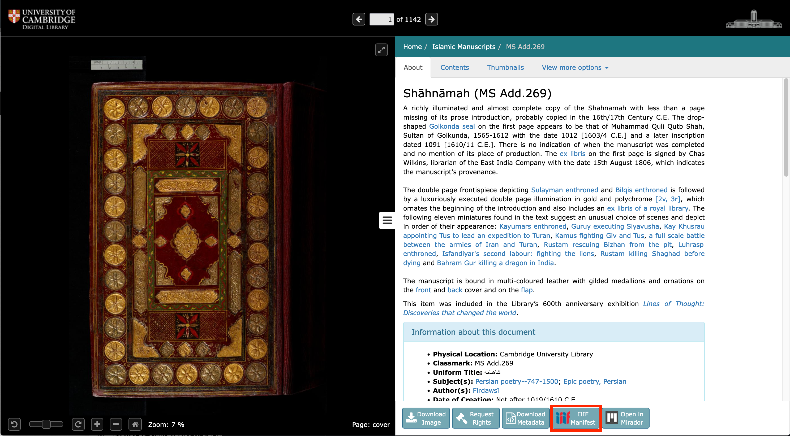
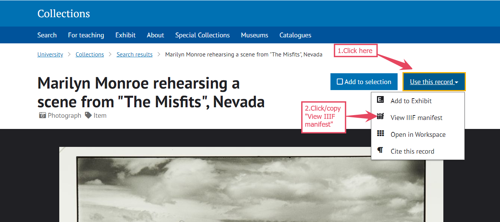

# Finding

Cultural heritage institutions that deliver freely licensed access to their digital collections using IIIF are listed on the [IIIF website](https://iiif.io/guides/finding\_resources/). The list includes major museums and galleries, state and national libraries, and research-led universities from around the world. The number of cultural heritage items made available via IIIF is estimated at 1 billion.

### Exercise: Finding and opening a IIIF object in Universal Viewer

Go to the [list of institutions that support IIIF](https://iiif.io/guides/finding\_resources/) on the IIIF website. Choose an institution's collections to explore - clicking on their name will lead you to a page that provides a link to their digital collections platform, and a screenshot showing where to find the manifest.

Manifests are the key to unlocking IIIF items for re-use. They look like this:

* example
* example
* example

Manifests look a bit like links, but they're more like parcels. Rather than push a user to the location of a digital object on the web, a manifest packages everything a computer needs to know in order for that user to pull the digital object into their current location. The package contains:

* links to all the images belonging to a digital object
* structural metadata - instructions on how to organise and present the images
* descriptive metadata - the title, author, date, location of the physical object

A manifest stores this information as json code - if you click on a manifest, or paste it into a browser's address bar, you can see it - but don't worry, you don't need to understand it! All you need to do is copy the manifest, and paste it into a IIIF viewer or tool in order for the object to render.

Every institution's digital collections platform presents information about its objects, manifests slightly differently, and some are easier to find than others. Some example screenshots:

<figure><figcaption></figcaption></figure>

<table data-column-title-hidden data-view="cards" data-full-width="true"><thead><tr><th></th><th data-hidden></th><th data-hidden></th><th data-hidden data-card-cover data-type="files"></th></tr></thead><tbody><tr><td></td><td></td><td></td><td><a href="../.gitbook/assets/loc.png">loc.png</a></td></tr><tr><td></td><td></td><td></td><td><a href="../.gitbook/assets/smithsonian.png">smithsonian.png</a></td></tr><tr><td></td><td></td><td></td><td><a href="../.gitbook/assets/standrews.png">standrews.png</a></td></tr></tbody></table>

<figure><figcaption></figcaption></figure>

 

<figure><figcaption></figcaption></figure>

 

<figure><figcaption></figcaption></figure>

 

<figure><figcaption></figcaption></figure>

