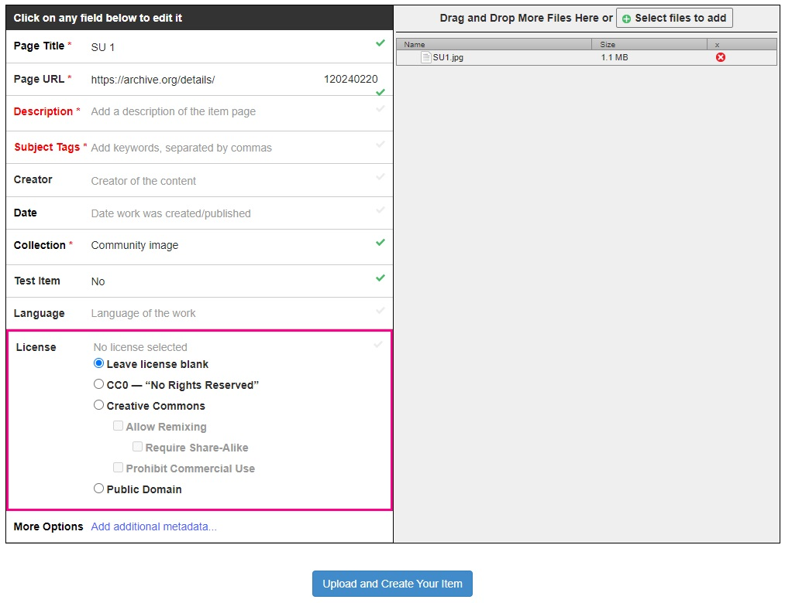

# Create IIIF images

IIIF is not just for major cultural heritage organisations with dedicated developers and server infrastructure. As of 2023, anyone can create IIIF-compatible images, for free, without access to an image server, by [uploading to the Internet Archive](https://archive.org/upload).&#x20;

Before uploading content, ensure that your images are suitable for public re-use, and select the appropriate Creative Commons licence when adding metadata:

<figure><figcaption>
The Internet Archive's <a href="https://archive.org/upload">upload interface</a>
</figcaption></figure>

The Internet Archive filename, found in the page URL, e.g...

**https://archive.org/details/**<mark style="color:red;">**\[filename]**</mark>

...can be added to this string to create a IIIF manifest:

**https://iiif.archive.org/iiif/3/**<mark style="color:red;">**\[filename]**</mark>**/manifest.json**&#x20;

The manifest can be pasted into any IIIF viewer or editing tool, for enhanced viewing and remixing.
