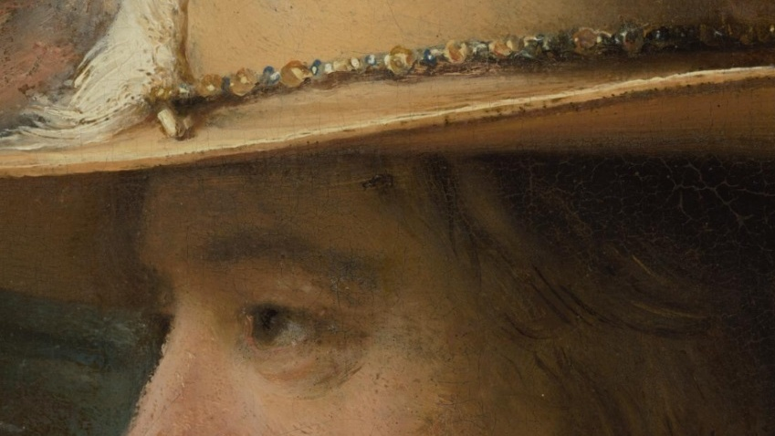

# What is IIIF?

One of the biggest issues faced by those who use digital representations of books, archives, or art in research or teaching, is that almost every library or museum presents their digitised material inconsistently. Different institutions use different digital viewers, varying in functionality and ease of use, and implement different rules about download and re-use. It's a confusing landscape to navigate.

The [International Image Interoperability Framework](https://iiif.io/), pronounced 'triple-eye-eff', aims to bring order to digital chaos. Essentially, it's a list of rules that institutions agree to adhere to. These rules determine a set way to present images and their descriptive data, ensuring that digital images can be viewed and shared online in a consistent and interoperable way, regardless of origin. Institutions that follow these rules are helping to break down digital silos, and unlock their collections for global re-use. To date, IIIF has been formally adopted by [over 100 major cultural heritage organisations](https://iiif.io/guides/finding\_resources/) worldwide.

IIIF offers a number of benefits. Images from libraries, archives, galleries, and museums that have adopted the framework can be:

### REUNITED

IIIF is designed with interoperability in mind. The images of any institution using the framework will work in the same way as those of another. This means that code from multiple digital objects can be stitched together to create a new digital composite, digitally reuniting and reconstructing cultural heritage that may have become physically separated across different repositories. [This demo](https://demos.biblissima.fr/chateauroux/demo/) shows the virtual reconstruction of a damaged manuscript from Châteauroux in France (Grandes Chroniques de France, ca. 1460). At some point in the manuscript's history, its fourteen illuminations were cut out, and by the 19th century, had ended up at the Bibliothèque Nationale de France. The digitisation of the [miniatures](https://gallica.bnf.fr/services/engine/search/sru?operation=searchRetrieve\&version=1.2\&maximumRecords=50\&page=1\&query=\(dc.source%20all%20%224-AD-133%22\)%20and%20\(dc.type%20all%20%22image%22\)) by BNF, and the [full manuscript](https://arca.irht.cnrs.fr/ark:/63955/md53ws85cj4c) by Chateauroux Municipal Library, allows the virtual reconstruction of the manuscript in its original state, using IIIF. In a single interface, the viewer can examine either Châteauroux's damaged manuscript, BNF's images, or both objects reunited.

<figure><figcaption>
This <a href="https://demos.biblissima.fr/chateauroux/demo/">demo</a> allows a damaged manuscript to be viewed in either its original or 'repaired' state.
</figcaption></figure>

### ENHANCED

In the example above, two digital layers can be toggled on or off, and their opacity adjusted, within the browser. This is purely for the benefit of the viewer - no changes are made to the original image. Similarly, [The Internet Archive](https://archive.org/details/arg160) features a tool to enhance images in-browser: adjusting brightness, contrast and polarity to improve accessibility and readability. Follow the link, and click on the ellipses on the left to access a visual adjustments menu. Altering these settings has various useful applications for bringing out details that might be hard to see in the original. It can be particularly valuable when trying to read faint handwriting on a manuscript, or decipher information that has been crossed out, representing a significant enhancement of the original document.

<figure><figcaption>
<a href="https://archive.org/details/arg160">Letter from Edward Thomas to Helen Thomas</a>, 25 Jan 1917
</figcaption></figure>

### EXAMINED

IIIF images can be zoomed into at astonishing levels of detail, quickly and responsively, even when the image is very large. This is because they're digitally segmented, or tiled like a mosaic, before being served to a web browser. When a browser loads a tiled image, it doesn’t render every tile – just enough pixels to make the image legible at its current size. When a viewer starts to zoom in on a section of the image, more tiles are loaded - but only for that section - and this reduces the processing power needed to view the image in detail. Take a look at [The Night Watch](https://hyper-resolution.org/view.html?pointer=0.329,0.001\&i=Rijksmuseum/SK-C-5/SK-C-5\_VIS\_20-um\_2019-12-21), from the Rijksmuseum, the largest and most detailed photo ever taken of a work of art. Strictly speaking, this is not a single digital image, but a composite of thousands of smaller images, as the original painting was photographed in high resolution 8,439 times. This creates a composite image of 5.6TB - without IIIF tiling, attempting to open a file that large would crash most browsers.

<figure><figcaption>
Zoomed in detail from <a href="https://hyper-resolution.org/view.html?pointer=0.329,0.001&#x26;i=Rijksmuseum/SK-C-5/SK-C-5_VIS_20-um_2019-12-21">The Night Watch</a>
</figcaption></figure>

IIIF images can also be **COMPARED**​ side by side in one browser window, and **ANNOTATED**​ with text or other images to add commentary or analysis. More on this later!

Sound good? Let's start by learning how to find IIIF images.
