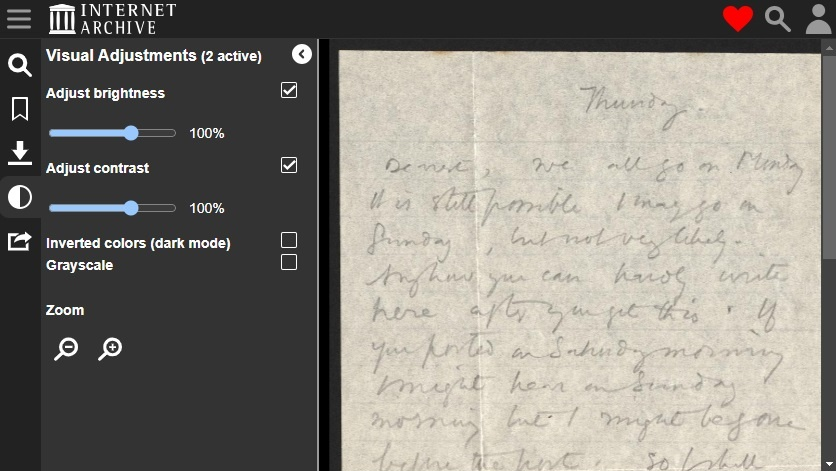

# Enhance

In the previous example, two digital layers could be toggled on or off, and their opacity adjusted, within the browser. This functionality is purely for the benefit of the viewer - no changes are made to the original image.

The Internet Archive, one of the world's largest free digital libraries, features a tool to enhance images in-browser: adjusting brightness, contrast and polarity to improve accessibility and readability. Here's an example of a [letter written by the poet Edward Thomas](https://archive.org/details/arg160), during his service as a First World War soldier. The letter is written in pencil on thin, poor quality paper.

<figure><figcaption>
<a href="https://archive.org/details/arg160">Letter from Edward Thomas to Helen Thomas</a>, 25 Jan 1917
</figcaption></figure>

In the left hand menu, the ellipsis on the left opens a visual adjustments menu. Here, you can zoom, switch the polarity, and adjust brightness, contrast, and saturation on the fly, without the need to edit the original.&#x20;

<figure><figcaption>
The same letter, with visual adjustments.
</figcaption></figure>

Altering these settings can digitally enhance details that might be hard or impossible to see, even if you had the original document in front of you. It can be particularly valuable when trying to read faint handwriting on a manuscript, or decipher information that has been crossed out, making the original document significantly more accessible and useful.
