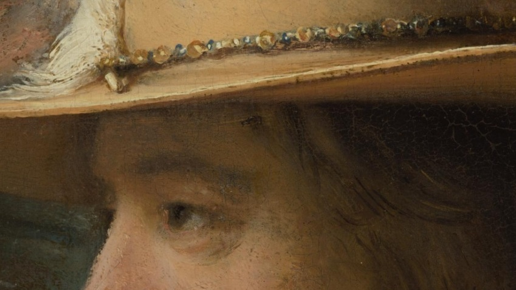

# Examine

IIIF images can be zoomed into at astonishing levels of detail, quickly and responsively, even when the image is very large. This is because they're digitally segmented, or tiled like a mosaic, before being served to a web browser.&#x20;

When a browser loads a tiled image, it doesn’t render every tile – just enough pixels to make the image legible at its current size. When a viewer starts to zoom in on a section of the image, more tiles are loaded - but only for that section - and this reduces the processing power needed to view the image in detail.&#x20;

Take a look at [The Night Watch](https://hyper-resolution.org/view.html?pointer=0.329,0.001\&i=Rijksmuseum/SK-C-5/SK-C-5\_VIS\_20-um\_2019-12-21), from the Rijksmuseum, the largest and most detailed photo ever taken of a work of art. Strictly speaking, this is not a single digital image, but a composite of thousands of smaller images, as the original painting was photographed in high resolution 8,439 times. This creates a composite image of 5.6TB - without IIIF tiling, attempting to open a file that large would crash most browsers.

<figure><figcaption>
Zoomed in detail from <a href="https://hyper-resolution.org/view.html?pointer=0.329,0.001&#x26;i=Rijksmuseum/SK-C-5/SK-C-5_VIS_20-um_2019-12-21">The Night Watch</a>
</figcaption></figure>

IIIF images can also be **COMPARED**​ side by side in one browser window, and **ANNOTATED**​ with text or other images to add commentary or analysis. More on this later!

Sound good? Let's start by learning [how to find IIIF images](../find-iiif-images.md).
