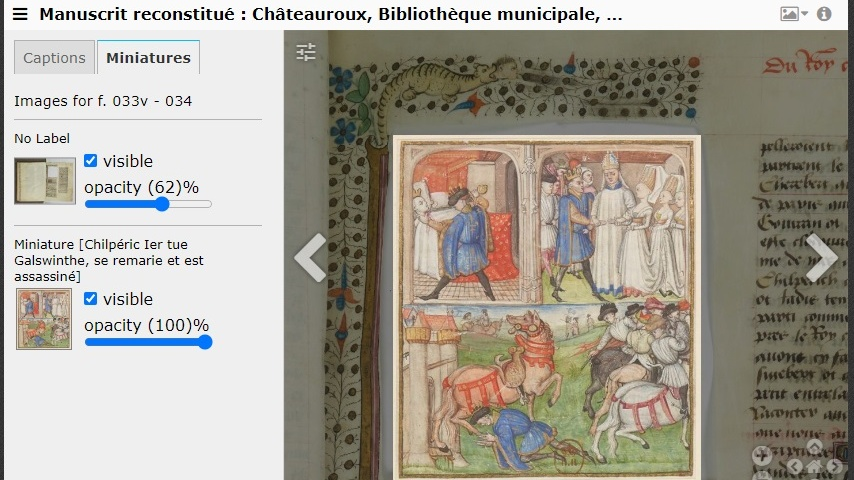

# Reunite

IIIF is designed with interoperability in mind. The images of any institution using the framework will work in the same way as those of another. This means that code from multiple digital objects can be stitched together to create a new digital composite, digitally reuniting and reconstructing cultural heritage that may have become physically separated across different repositories.&#x20;

[This demo](https://demos.biblissima.fr/chateauroux/demo/) shows the virtual reconstruction of a damaged manuscript from Châteauroux in France (Grandes Chroniques de France, ca. 1460). At some point in the manuscript's history, its fourteen illuminations were cut out, and by the 19th century, had ended up at the Bibliothèque Nationale de France.&#x20;

The digitisation of the [miniatures](https://gallica.bnf.fr/services/engine/search/sru?operation=searchRetrieve\&version=1.2\&maximumRecords=50\&page=1\&query=\(dc.source%20all%20%224-AD-133%22\)%20and%20\(dc.type%20all%20%22image%22\)) by BNF, and the [full manuscript](https://arca.irht.cnrs.fr/ark:/63955/md53ws85cj4c) by Chateauroux Municipal Library, allows the virtual reconstruction of the manuscript in its original state, using IIIF. In a single interface, the viewer can examine either Châteauroux's damaged manuscript, BNF's images, or both objects reunited.

<figure><figcaption>
This <a href="https://demos.biblissima.fr/chateauroux/demo/">demo</a> allows a damaged manuscript to be viewed in either its original or 'repaired' state.
</figcaption></figure>
