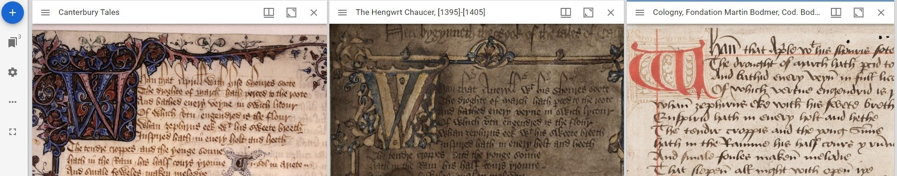

# Compare

There may be times when you want to compare multiple digital objects from repositories, that might be on different sides of the world. Preliminary sketches with a final artwork, or multiple versions of a manuscript. IIIF supports this too, using Mirador, a web-based viewer

### How to use the Mirador viewer

* Find a IIIF manifest: A manifest is a JSON file - a unique link combining the digital images you want to view, and their metadata. See this guide to [finding IIIF images](finding-iiif-images.md) for more information about manifests, and how to find them in digital collections or repositories that support IIIF, such as the [British Library](https://iiif.io/guides/guides/bl.uk/), [Harvard](https://iiif.io/guides/guides/library.harvard.edu/), [Library of Congress](https://iiif.io/guides/guides/loc.gov/), or the [Bodleian](https://iiif.io/guides/guides/digital.bodleian.ox.ac.uk/). Some example manifests are listed below.
* Once you've found a IIIF manifest, [open the Mirador viewer in your web browser](https://projectmirador.org/demo/). This will open Mirador with a default set of images. Use the X button in the top right of each to clear the default images.
* To load a IIIF manifest into Mirador, click on the '+ Start here' button in the top left corner of the viewer. You'll see a list of sample manifests - click 'Add resource' in the bottom right to add a new one. Paste the URL of a IIIF manifest into the text field and click 'Add'. Here are some manifests (JSON links) of three different 15th century manuscripts of Chaucer's Canterbury Tales. Try copying each link, and pasting them in Mirador:
  * The Ellesmere Chaucer, from the Huntingdon Library, California [https://hdl.huntington.org/iiif/2/p15150coll7:2838/manifest.json](https://hdl.huntington.org/iiif/2/p15150coll7:2838/manifest.json)
  * The Hengwrt Chaucer, from the National Library of Wales, Aberystwyth. Sometimes manifests are duplicated in the URL - in this case, just copy and paste the section following the equals sign [https://damsssl.llgc.org.uk/iiif/2.0/4628556/manifest.json?manifest=**https://damsssl.llgc.org.uk/iiif/2.0/4628556/manifest.json**](https://damsssl.llgc.org.uk/iiif/2.0/4628556/manifest.json?manifest=https://damsssl.llgc.org.uk/iiif/2.0/4628556/manifest.json)
  * The Bodmer Chaucer, from Fondation Martin Bodmer, Switzerland [https://www.e-codices.ch/metadata/iiif/fmb-cb-0048/manifest.json](https://www.e-codices.ch/metadata/iiif/fmb-cb-0048/manifest.json)
* Each object will appear in a new row at the top of the list of examples. Click on the object to load its images into the viewer, and display them in the main window. Go back to the '+' button to add more objects.

<figure><figcaption><p>Three Chaucer manuscripts have been added to the workspace. Click on each row to load them in the viewer.</p></figcaption></figure>

* You can navigate and manipulate the images in Mirador in several ways. Clicking and dragging the header or the side of an object allows you to reposition the images in relation to one another. You can zoom in and out using the mouse scroll wheel, and pan around the image by clicking and dragging with the mouse. Use the arrow icons at the bottom of the selected item to turn the pages. The Hengwrt Chaucer loads a two-page view by default. You can change this by clicking the 'window views and thumbnail display' button at the top of the object, which offers options for a single page view or gallery view of all pages.

<figure><figcaption><p>Mirador viewer with three manuscripts loaded for comparison</p></figcaption></figure>

* To view the metadata associated with an image, click on the hamburger button (three horizontal lines) to the top left of each object. This will display the metadata in a panel on the left side of the viewer.
* If you want to save or share the current state of the viewer, you can click on the '...' button in the left toolbar. 'Export' generates code that you can copy and send to another user - who can paste it under the 'Import' option in their own browser. You can also save the code for your own use if you want to come back to your workspace at a later date.
* Try copying this code, and pasting to Mirador using the 'import workspace' option:

```
{
  "catalog": [
    {
      "manifestId": "https://www.e-codices.ch/metadata/iiif/fmb-cb-0048/manifest.json"
    },
    {
      "manifestId": "https://damsssl.llgc.org.uk/iiif/2.0/4628556/manifest.json"
    },
    {
      "manifestId": "https://hdl.huntington.org/iiif/2/p15150coll7:2838/manifest.json"
    },
    {
      "manifestId": "https://iiif.bodleian.ox.ac.uk/iiif/manifest/e32a277e-91e2-4a6d-8ba6-cc4bad230410.json"
    },
    {
      "manifestId": "https://iiif.harvardartmuseums.org/manifests/object/299843"
    },
    {
      "manifestId": "https://media.nga.gov/public/manifests/nga_highlights.json",
      "provider": "National Gallery of Art"
    },
    {
      "manifestId": "https://data.ucd.ie/api/img/manifests/ucdlib:33064",
      "provider": "Irish Architectural Archive"
    },
    {
      "manifestId": "https://wellcomelibrary.org/iiif/b18035723/manifest",
      "provider": "Wellcome Library"
    },
    {
      "manifestId": "https://demos.biblissima.fr/iiif/metadata/florus-dispersus/manifest.json",
      "provider": "Biblissima"
    },
    {
      "manifestId": "https://www.e-codices.unifr.ch/metadata/iiif/gau-Fragment/manifest.json",
      "provider": "e-codices - Virtual Manuscript Library of Switzerland"
    },
    {
      "manifestId": "https://wellcomelibrary.org/iiif/collection/b18031511",
      "provider": "Wellcome Library"
    },
    {
      "manifestId": "https://gallica.bnf.fr/iiif/ark:/12148/btv1b10022508f/manifest.json",
      "provider": "Bibliothèque nationale de France"
    },
    {
      "manifestId": "https://manifests.britishart.yale.edu/Osbornfa1",
      "provider": "Beinecke Rare Book and Manuscript Library, Yale University"
    },
    {
      "manifestId": "https://iiif.biblissima.fr/chateauroux/B360446201_MS0005/manifest.json",
      "provider": "Biblissima"
    },
    {
      "manifestId": "https://iiif.durham.ac.uk/manifests/trifle/32150/t1/m4/q7/t1m4q77fr328/manifest",
      "provider": "Durham University Library"
    },
    {
      "manifestId": "https://zavicajna.digitalna.rs/iiif/api/presentation/3/96571949-03d6-478e-ab44-a2d5ad68f935%252F00000001%252Fostalo01%252F00000071/manifest",
      "provider": "Библиотека 'Милутин Бојић'"
    }
  ],
  "companionWindows": {
    "cw-55b12ce4-52a5-43b1-ac6a-1972e974d879": {
      "content": "info",
      "default": true,
      "id": "cw-55b12ce4-52a5-43b1-ac6a-1972e974d879",
      "position": "left"
    },
    "cw-b19a09c3-d3bf-4682-b6cc-44890ed589a2": {
      "content": "thumbnailNavigation",
      "default": true,
      "id": "cw-b19a09c3-d3bf-4682-b6cc-44890ed589a2",
      "position": "far-bottom"
    },
    "cw-53330e5c-2812-4f5b-a7e7-bf747c83c69e": {
      "content": "info",
      "default": true,
      "id": "cw-53330e5c-2812-4f5b-a7e7-bf747c83c69e",
      "position": "left"
    },
    "cw-8fbcfc55-16cf-4f86-b2a6-85c7f05a9a17": {
      "content": "thumbnailNavigation",
      "default": true,
      "id": "cw-8fbcfc55-16cf-4f86-b2a6-85c7f05a9a17",
      "position": "off"
    },
    "cw-de4af613-450a-4f53-a4ce-24e78beeed06": {
      "content": "info",
      "default": true,
      "id": "cw-de4af613-450a-4f53-a4ce-24e78beeed06",
      "position": "left"
    },
    "cw-d59a27a5-df8b-4050-ae41-b155c114caf3": {
      "content": "thumbnailNavigation",
      "default": true,
      "id": "cw-d59a27a5-df8b-4050-ae41-b155c114caf3",
      "position": "off"
    },
    "cw-ae38e802-efbf-4aa5-9949-6d3cac546c0a": {
      "content": "info",
      "default": true,
      "id": "cw-ae38e802-efbf-4aa5-9949-6d3cac546c0a",
      "position": "left"
    },
    "cw-7e426bb9-bded-4e09-966f-9ac254244dac": {
      "content": "thumbnailNavigation",
      "default": true,
      "id": "cw-7e426bb9-bded-4e09-966f-9ac254244dac",
      "position": "off"
    },
    "cw-7481d2f5-2cfa-42d0-b83d-0daa62d5a0db": {
      "content": "info",
      "default": true,
      "id": "cw-7481d2f5-2cfa-42d0-b83d-0daa62d5a0db",
      "position": "left"
    },
    "cw-6e587fc8-2d94-4535-8810-7904a056278c": {
      "content": "thumbnailNavigation",
      "default": true,
      "id": "cw-6e587fc8-2d94-4535-8810-7904a056278c",
      "position": "off"
    }
  },
  "config": {
    "state": {},
    "canvasNavigation": {
      "height": 50,
      "width": 50
    },
    "selectedTheme": "light",
    "themes": {
      "dark": {
        "palette": {
          "type": "dark",
          "primary": {
            "main": "#4db6ac"
          },
          "secondary": {
            "main": "#4db6ac"
          },
          "shades": {
            "dark": "#000000",
            "main": "#424242",
            "light": "#616161"
          }
        }
      },
      "light": {
        "palette": {
          "type": "light"
        }
      }
    },
    "theme": {
      "palette": {
        "type": "light",
        "primary": {
          "main": "#1967d2"
        },
        "secondary": {
          "main": "#1967d2"
        },
        "shades": {
          "dark": "#eeeeee",
          "main": "#ffffff",
          "light": "#f5f5f5"
        },
        "error": {
          "main": "#b00020"
        },
        "notification": {
          "main": "#ffa224"
        },
        "hitCounter": {
          "default": "#bdbdbd"
        },
        "highlights": {
          "primary": "#ffff00",
          "secondary": "#00BFFF"
        },
        "section_divider": "rgba(0, 0, 0, 0.25)",
        "annotations": {
          "hidden": {
            "globalAlpha": 0
          },
          "default": {
            "strokeStyle": "#00BFFF",
            "globalAlpha": 1
          },
          "hovered": {
            "strokeStyle": "#BF00FF",
            "globalAlpha": 1
          },
          "selected": {
            "strokeStyle": "#ffff00",
            "globalAlpha": 1
          }
        },
        "search": {
          "default": {
            "fillStyle": "#00BFFF",
            "globalAlpha": 0.3
          },
          "hovered": {
            "fillStyle": "#00FFFF",
            "globalAlpha": 0.3
          },
          "selected": {
            "fillStyle": "#ffff00",
            "globalAlpha": 0.3
          }
        }
      },
      "typography": {
        "body1": {
          "fontSize": "1rem",
          "letterSpacing": "0em",
          "lineHeight": "1.6em"
        },
        "body2": {
          "fontSize": "0.878rem",
          "letterSpacing": "0.015em",
          "lineHeight": "1.6em"
        },
        "button": {
          "fontSize": "0.878rem",
          "letterSpacing": "0.09em",
          "lineHeight": "2.25rem",
          "textTransform": "uppercase"
        },
        "caption": {
          "fontSize": "0.772rem",
          "letterSpacing": "0.033em",
          "lineHeight": "1.6rem"
        },
        "body1Next": {
          "fontSize": "1rem",
          "letterSpacing": "0em",
          "lineHeight": "1.6em"
        },
        "body2Next": {
          "fontSize": "0.878rem",
          "letterSpacing": "0.015em",
          "lineHeight": "1.6em"
        },
        "buttonNext": {
          "fontSize": "0.878rem",
          "letterSpacing": "0.09em",
          "lineHeight": "2.25rem"
        },
        "captionNext": {
          "fontSize": "0.772rem",
          "letterSpacing": "0.33em",
          "lineHeight": "1.6rem"
        },
        "overline": {
          "fontSize": "0.678rem",
          "fontWeight": 500,
          "letterSpacing": "0.166em",
          "lineHeight": "2em",
          "textTransform": "uppercase"
        },
        "h1": {
          "fontSize": "2.822rem",
          "letterSpacing": "-0.015em",
          "lineHeight": "1.2em"
        },
        "h2": {
          "fontSize": "1.575rem",
          "letterSpacing": "0em",
          "lineHeight": "1.33em"
        },
        "h3": {
          "fontSize": "1.383rem",
          "fontWeight": 300,
          "letterSpacing": "0em",
          "lineHeight": "1.33em"
        },
        "h4": {
          "fontSize": "1.215rem",
          "letterSpacing": "0.007em",
          "lineHeight": "1.45em"
        },
        "h5": {
          "fontSize": "1.138rem",
          "letterSpacing": "0.005em",
          "lineHeight": "1.55em"
        },
        "h6": {
          "fontSize": "1.067rem",
          "fontWeight": 400,
          "letterSpacing": "0.01em",
          "lineHeight": "1.6em"
        },
        "subtitle1": {
          "fontSize": "0.937rem",
          "letterSpacing": "0.015em",
          "lineHeight": "1.6em",
          "fontWeight": 300
        },
        "subtitle2": {
          "fontSize": "0.878rem",
          "fontWeight": 500,
          "letterSpacing": "0.02em",
          "lineHeight": "1.75em"
        },
        "useNextVariants": true
      },
      "overrides": {
        "MuiListSubheader": {
          "root": {
            "&[role=\"presentation\"]:focus": {
              "outline": 0
            }
          }
        },
        "MuiTooltip": {
          "tooltipPlacementLeft": {
            "@media (min-width:600px)": {
              "margin": 0
            }
          },
          "tooltipPlacementRight": {
            "@media (min-width:600px)": {
              "margin": 0
            }
          },
          "tooltipPlacementTop": {
            "@media (min-width:600px)": {
              "margin": 0
            }
          },
          "tooltipPlacementBottom": {
            "@media (min-width:600px)": {
              "margin": 0
            }
          }
        },
        "MuiTouchRipple": {
          "childPulsate": {
            "animation": "none"
          },
          "rippleVisible": {
            "animation": "none"
          }
        }
      },
      "props": {
        "MuiButtonBase": {
          "disableTouchRipple": true
        },
        "MuiLink": {
          "underline": "always"
        }
      },
      "transitions": {}
    },
    "language": "en",
    "availableLanguages": {
      "ar": "العربية",
      "de": "Deutsch",
      "en": "English",
      "fa": "فارسی",
      "fr": "Français",
      "ja": "日本語",
      "kr": "한국어",
      "lt": "Lietuvių",
      "nl": "Nederlands",
      "nb-NO": "Norwegian Bokmål",
      "pl": "Polski",
      "pt-BR": "Português do Brasil",
      "vi": "Tiếng Việt",
      "zh-CN": "中文(简体)",
      "zh-TW": "中文(繁體)",
      "it": "Italiano",
      "sr": "Српски",
      "sv": "Svenska",
      "bg": "Български"
    },
    "annotations": {
      "htmlSanitizationRuleSet": "iiif",
      "filteredMotivations": [
        "oa:commenting",
        "oa:tagging",
        "sc:painting",
        "commenting",
        "tagging"
      ]
    },
    "createGenerateClassNameOptions": {
      "productionPrefix": "mirador"
    },
    "requests": {
      "preprocessors": [],
      "postprocessors": []
    },
    "translations": {},
    "window": {
      "allowClose": true,
      "allowFullscreen": false,
      "allowMaximize": true,
      "allowTopMenuButton": true,
      "allowWindowSideBar": true,
      "authNewWindowCenter": "parent",
      "sideBarPanel": "info",
      "defaultSidebarPanelHeight": 201,
      "defaultSidebarPanelWidth": 235,
      "defaultView": "single",
      "forceDrawAnnotations": false,
      "hideWindowTitle": false,
      "highlightAllAnnotations": false,
      "showLocalePicker": false,
      "sideBarOpen": false,
      "switchCanvasOnSearch": true,
      "panels": {
        "info": true,
        "attribution": true,
        "canvas": true,
        "annotations": true,
        "search": true,
        "layers": true
      },
      "views": [
        {
          "key": "single",
          "behaviors": [
            "individuals"
          ]
        },
        {
          "key": "book",
          "behaviors": [
            "paged"
          ]
        },
        {
          "key": "scroll",
          "behaviors": [
            "continuous"
          ]
        },
        {
          "key": "gallery"
        }
      ],
      "elastic": {
        "height": 400,
        "width": 480
      }
    },
    "windows": [
      {
        "manifestId": "https://iiif.harvardartmuseums.org/manifests/object/299843",
        "canvasId": "https://iiif.harvardartmuseums.org/manifests/object/299843/canvas/canvas-47174892",
        "thumbnailNavigationPosition": "far-bottom"
      },
      {
        "manifestId": "https://iiif.bodleian.ox.ac.uk/iiif/manifest/e32a277e-91e2-4a6d-8ba6-cc4bad230410.json"
      }
    ],
    "thumbnails": {
      "preferredFormats": [
        "jpg",
        "png",
        "webp",
        "tif"
      ]
    },
    "thumbnailNavigation": {
      "defaultPosition": "off",
      "displaySettings": true,
      "height": 130,
      "width": 100
    },
    "workspace": {
      "draggingEnabled": true,
      "allowNewWindows": true,
      "id": "3d2e57b0-ee6f-4357-b78a-7fbef4df8e14",
      "isWorkspaceAddVisible": false,
      "exposeModeOn": false,
      "height": 5000,
      "showZoomControls": false,
      "type": "mosaic",
      "viewportPosition": {
        "x": 0,
        "y": 0
      },
      "width": 5000
    },
    "workspaceControlPanel": {
      "enabled": true
    },
    "galleryView": {
      "height": 120,
      "width": null
    },
    "osdConfig": {
      "alwaysBlend": false,
      "blendTime": 0.1,
      "preserveImageSizeOnResize": true,
      "preserveViewport": true,
      "showNavigationControl": false
    },
    "export": {
      "catalog": true,
      "companionWindows": true,
      "config": true,
      "elasticLayout": true,
      "layers": true,
      "manifests": {},
      "viewers": true,
      "windows": true,
      "workspace": true
    },
    "audioOptions": {
      "controls": true,
      "crossOrigin": "anonymous"
    },
    "videoOptions": {
      "controls": true,
      "crossOrigin": "anonymous"
    },
    "auth": {
      "serviceProfiles": [
        {
          "profile": "http://iiif.io/api/auth/1/external",
          "external": true
        },
        {
          "profile": "http://iiif.io/api/auth/1/kiosk",
          "kiosk": true
        },
        {
          "profile": "http://iiif.io/api/auth/1/clickthrough"
        },
        {
          "profile": "http://iiif.io/api/auth/1/login"
        },
        {
          "profile": "http://iiif.io/api/auth/0/external",
          "external": true
        },
        {
          "profile": "http://iiif.io/api/auth/0/kiosk",
          "kiosk": true
        },
        {
          "profile": "http://iiif.io/api/auth/0/clickthrough"
        },
        {
          "profile": "http://iiif.io/api/auth/0/login"
        }
      ]
    },
    "id": "mirador",
    "catalog": [
      {
        "manifestId": "https://iiif.bodleian.ox.ac.uk/iiif/manifest/e32a277e-91e2-4a6d-8ba6-cc4bad230410.json"
      },
      {
        "manifestId": "https://iiif.harvardartmuseums.org/manifests/object/299843"
      },
      {
        "manifestId": "https://media.nga.gov/public/manifests/nga_highlights.json",
        "provider": "National Gallery of Art"
      },
      {
        "manifestId": "https://data.ucd.ie/api/img/manifests/ucdlib:33064",
        "provider": "Irish Architectural Archive"
      },
      {
        "manifestId": "https://wellcomelibrary.org/iiif/b18035723/manifest",
        "provider": "Wellcome Library"
      },
      {
        "manifestId": "https://demos.biblissima.fr/iiif/metadata/florus-dispersus/manifest.json",
        "provider": "Biblissima"
      },
      {
        "manifestId": "https://www.e-codices.unifr.ch/metadata/iiif/gau-Fragment/manifest.json",
        "provider": "e-codices - Virtual Manuscript Library of Switzerland"
      },
      {
        "manifestId": "https://wellcomelibrary.org/iiif/collection/b18031511",
        "provider": "Wellcome Library"
      },
      {
        "manifestId": "https://gallica.bnf.fr/iiif/ark:/12148/btv1b10022508f/manifest.json",
        "provider": "Bibliothèque nationale de France"
      },
      {
        "manifestId": "https://manifests.britishart.yale.edu/Osbornfa1",
        "provider": "Beinecke Rare Book and Manuscript Library, Yale University"
      },
      {
        "manifestId": "https://iiif.biblissima.fr/chateauroux/B360446201_MS0005/manifest.json",
        "provider": "Biblissima"
      },
      {
        "manifestId": "https://iiif.durham.ac.uk/manifests/trifle/32150/t1/m4/q7/t1m4q77fr328/manifest",
        "provider": "Durham University Library"
      },
      {
        "manifestId": "https://zavicajna.digitalna.rs/iiif/api/presentation/3/96571949-03d6-478e-ab44-a2d5ad68f935%252F00000001%252Fostalo01%252F00000071/manifest",
        "provider": "Библиотека 'Милутин Бојић'"
      }
    ]
  },
  "elasticLayout": {
    "window-f2171310-a251-4822-8b39-7055c6356307": {
      "windowId": "window-f2171310-a251-4822-8b39-7055c6356307",
      "height": 400,
      "width": 480,
      "x": 200,
      "y": 200
    },
    "window-4e85864b-477e-494a-82ec-fac6057bceda": {
      "windowId": "window-4e85864b-477e-494a-82ec-fac6057bceda",
      "height": 400,
      "width": 480,
      "x": 230,
      "y": 250
    },
    "window-2f165bb6-cb71-43ff-9a33-c31929f054c8": {
      "windowId": "window-2f165bb6-cb71-43ff-9a33-c31929f054c8",
      "height": 400,
      "width": 480,
      "x": 260,
      "y": 300
    }
  },
  "layers": {},
  "manifests": {},
  "viewers": {
    "window-f2171310-a251-4822-8b39-7055c6356307": {
      "flip": false,
      "rotation": 0,
      "x": 1080,
      "y": 1246,
      "zoom": 0.0007257154270266752
    },
    "window-4e85864b-477e-494a-82ec-fac6057bceda": {
      "flip": false,
      "rotation": 0,
      "x": 1720,
      "y": 2804,
      "zoom": 0.0003349616189811584
    },
    "window-2f165bb6-cb71-43ff-9a33-c31929f054c8": {
      "flip": false,
      "rotation": 0,
      "x": 1454,
      "y": 2402,
      "zoom": 0.00039011413625014853
    }
  },
  "windows": {
    "window-f2171310-a251-4822-8b39-7055c6356307": {
      "canvasId": "https://cdm16003.contentdm.oclc.org/iiif/p15150coll7:2367/canvas/c8",
      "collectionIndex": 0,
      "companionAreaOpen": true,
      "companionWindowIds": [
        "cw-de4af613-450a-4f53-a4ce-24e78beeed06",
        "cw-d59a27a5-df8b-4050-ae41-b155c114caf3"
      ],
      "draggingEnabled": true,
      "highlightAllAnnotations": false,
      "id": "window-f2171310-a251-4822-8b39-7055c6356307",
      "manifestId": "https://hdl.huntington.org/iiif/2/p15150coll7:2838/manifest.json",
      "maximized": false,
      "rangeId": null,
      "rotation": null,
      "selectedAnnotations": {},
      "sideBarOpen": false,
      "sideBarPanel": "info",
      "thumbnailNavigationId": "cw-d59a27a5-df8b-4050-ae41-b155c114caf3",
      "visibleCanvases": [
        "https://cdm16003.contentdm.oclc.org/iiif/p15150coll7:2367/canvas/c8"
      ]
    },
    "window-4e85864b-477e-494a-82ec-fac6057bceda": {
      "canvasId": "https://damsssl.llgc.org.uk/iiif/2.0/4628556/canvas/4628571.json",
      "collectionIndex": 0,
      "companionAreaOpen": true,
      "companionWindowIds": [
        "cw-ae38e802-efbf-4aa5-9949-6d3cac546c0a",
        "cw-7e426bb9-bded-4e09-966f-9ac254244dac"
      ],
      "draggingEnabled": true,
      "highlightAllAnnotations": false,
      "id": "window-4e85864b-477e-494a-82ec-fac6057bceda",
      "manifestId": "https://damsssl.llgc.org.uk/iiif/2.0/4628556/manifest.json",
      "maximized": false,
      "rangeId": null,
      "rotation": null,
      "selectedAnnotations": {},
      "sideBarOpen": false,
      "sideBarPanel": "info",
      "thumbnailNavigationId": "cw-7e426bb9-bded-4e09-966f-9ac254244dac",
      "visibleCanvases": [
        "https://damsssl.llgc.org.uk/iiif/2.0/4628556/canvas/4628571.json"
      ],
      "view": "single"
    },
    "window-2f165bb6-cb71-43ff-9a33-c31929f054c8": {
      "canvasId": "https://www.e-codices.ch/metadata/iiif/fmb-cb-0048/canvas/fmb-cb-0048_001r.json",
      "collectionIndex": 0,
      "companionAreaOpen": true,
      "companionWindowIds": [
        "cw-7481d2f5-2cfa-42d0-b83d-0daa62d5a0db",
        "cw-6e587fc8-2d94-4535-8810-7904a056278c"
      ],
      "draggingEnabled": true,
      "highlightAllAnnotations": false,
      "id": "window-2f165bb6-cb71-43ff-9a33-c31929f054c8",
      "manifestId": "https://www.e-codices.ch/metadata/iiif/fmb-cb-0048/manifest.json",
      "maximized": false,
      "rangeId": null,
      "rotation": null,
      "selectedAnnotations": {},
      "sideBarOpen": false,
      "sideBarPanel": "info",
      "thumbnailNavigationId": "cw-6e587fc8-2d94-4535-8810-7904a056278c",
      "visibleCanvases": [
        "https://www.e-codices.ch/metadata/iiif/fmb-cb-0048/canvas/fmb-cb-0048_001r.json"
      ]
    }
  },
  "workspace": {
    "draggingEnabled": true,
    "allowNewWindows": true,
    "id": "3d2e57b0-ee6f-4357-b78a-7fbef4df8e14",
    "isWorkspaceAddVisible": false,
    "exposeModeOn": false,
    "height": 5000,
    "showZoomControls": false,
    "type": "mosaic",
    "viewportPosition": {
      "x": 0,
      "y": 0
    },
    "width": 5000,
    "windowIds": [
      "window-f2171310-a251-4822-8b39-7055c6356307",
      "window-4e85864b-477e-494a-82ec-fac6057bceda",
      "window-2f165bb6-cb71-43ff-9a33-c31929f054c8"
    ],
    "focusedWindowId": "window-f2171310-a251-4822-8b39-7055c6356307",
    "layout": {
      "first": "window-f2171310-a251-4822-8b39-7055c6356307",
      "second": {
        "first": "window-4e85864b-477e-494a-82ec-fac6057bceda",
        "second": "window-2f165bb6-cb71-43ff-9a33-c31929f054c8",
        "direction": "row"
      },
      "direction": "row",
      "splitPercentage": 29.252437703141926
    }
  }
}
```
