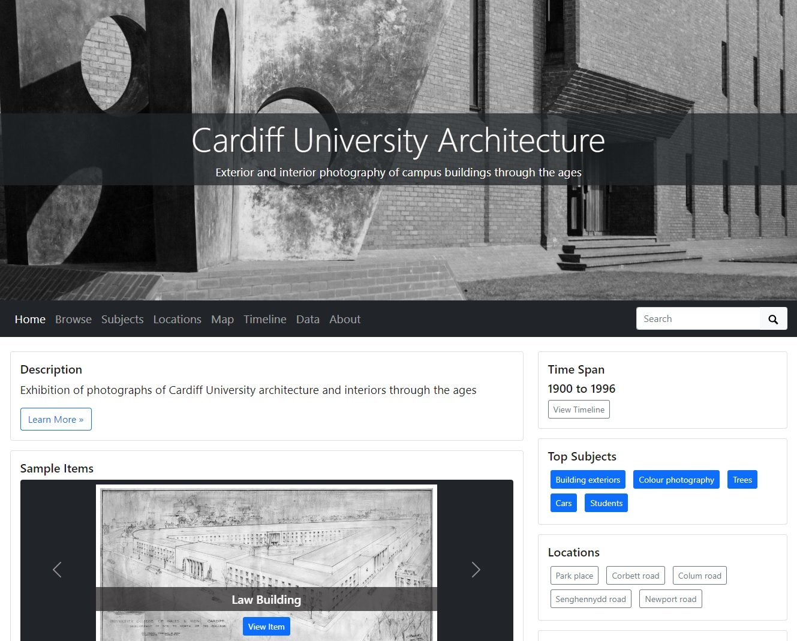

# Enhance

One advantage of IIIF for working with images is the ease with which they can be manipulated by the viewer within the browser, without altering the original file.&#x20;

<figure><figcaption>
David Wilkie, <a href="https://bsip.org.uk/mirador?manifest=https://bsip.org.uk/iiif-s/manifest/Y1urNPieedBC2kfb_mij5UVrLyruoLj9UZzM_5asOvW0siOVbYDpwrwUqXhiaRUmoz57vN3uhZG-PRUJ6UsnyA==.json">The Penny Wedding</a> (1818)
</figcaption></figure>

In this example, [The Penny Wedding](https://bsip.org.uk/mirador?manifest=https://bsip.org.uk/iiif-s/manifest/Y1urNPieedBC2kfb\_mij5UVrLyruoLj9UZzM\_5asOvW0siOVbYDpwrwUqXhiaRUmoz57vN3uhZG-PRUJ6UsnyA==.json) has been opened in a IIIF viewer. Using the controls on the top right, you can zoom, rotate, flip, switch the polarity, and adjust brightness, contrast, and saturation on the fly, without the need to edit the file itself.&#x20;

Altering these settings has various useful applications for bringing out details that might be hard to see in the original. It can be particularly valuable when trying to read faint handwriting on a manuscript, or decipher information that has been crossed out, representing a significant enhancement of the original document.
